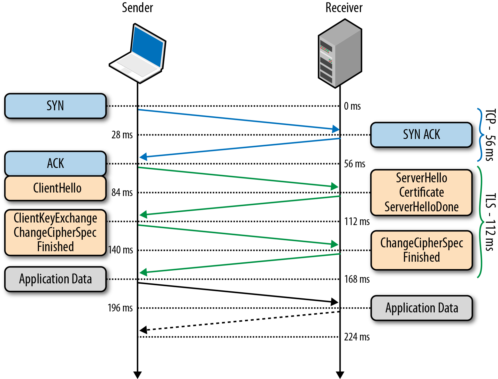

# 1 Канальная и пакетная коммутация

**Коммутация** — это процесс соединения узлов сети для передачи информации между ними. В истории развития сетей связи и компьютерных сетей сформировались два фундаментальных принципа коммутации: канальная и пакетная.

**Коммутация каналов** — это исторически первый метод, ярчайшим примером которого является традиционная телефонная сеть. Как показано в презентации на примере работы телефонисток, суть этого метода заключается в создании непрерывного сквозного физического или логического канала между двумя абонентами на все время сеанса связи. Процесс проходит в три этапа:
**Установление соединения**: Перед началом передачи данных происходит формирование выделенного канала через все транзитные узлы сети. Ресурсы (пропускная способность) на каждом участке этого пути резервируются исключительно для данной сессии.
**Передача данных**: Абоненты обмениваются информацией по этому выделенному, стабильному каналу.
Разъединение: После завершения сеанса канал освобождается, и зарезервированные ресурсы становятся доступны для других соединений.

Ключевые характеристики коммутации каналов:
Стабильная пропускная способность: Поскольку канал выделен, скорость передачи данных постоянна и гарантирована на протяжении всего сеанса. Это идеально для приложений реального времени, таких как голосовая связь, где задержки критичны.
Отказ при отсутствии свободных каналов: Если на каком-либо участке сети нет свободных ресурсов для построения полного канала, в соединении будет отказано. Мы знаем это по телефонному сигналу "занято".
Неэффективное использование пропускной способности: Это главный недостаток. Ресурсы канала зарезервированы на всё время соединения, даже если данные не передаются (например, во время пауз в разговоре). Сеть не может использовать эти "простаивающие" ресурсы для других передач, что делает технологию неэкономичной для трафика с пульсирующим характером, свойственного компьютерным данным.
Технология может использоваться как в аналоговых, так и в цифровых сетях.

Коммутация пакетов — это более современный и эффективный метод, который лежит в основе работы Интернета и большинства современных компьютерных сетей.

Принцип этого метода кардинально отличается. Вся передаваемая информация (будь то файл, веб-страница или сообщение) разбивается на небольшие блоки фиксированного или переменного размера, называемые пакетами. Каждый пакет снабжается служебной информацией, включая адрес получателя и отправителя.

Далее все пакеты отправляются в сеть независимо друг от друга. Сетевые устройства (маршрутизаторы, коммутаторы) считывают адрес в заголовке каждого пакета и направляют его к следующему узлу по пути к месту назначения. Пакеты от разных пользователей и приложений перемешиваются в общем потоке данных, совместно используя сетевые каналы. В пункте назначения пакеты собираются вместе и выстраиваются в исходном порядке для восстановления первоначального сообщения.

Характеристики коммутации пакетов, согласно презентации:

Эффективное использование пропускной способности: Каналы связи используются совместно множеством пользователей. Ресурсы выделяются только в тот момент, когда нужно отправить пакет. Это позволяет обслужить гораздо большее количество абонентов на той же инфраструктуре.
Негарантированная пропускная способность: Поскольку ресурсы сети общие, при большом количестве одновременных передач может возникнуть перегрузка канала. Это приводит к увеличению задержек (jitter) и снижению скорости передачи. В критических случаях может происходить потеря пакетов, когда буферы маршрутизаторов переполняются. Для борьбы с потерями используются протоколы более высокого уровня, такие как TCP, которые запрашивают повторную передачу утерянных пакетов.
Надежность и гибкость: Сеть становится более устойчивой к отказам. Если какой-то узел или канал выходит из строя, пакеты могут быть автоматически перенаправлены по альтернативным маршрутам.
Используется только в цифровых сетях.
Таким образом, если коммутация каналов предлагает гарантированное качество обслуживания ценой неэффективности, то коммутация пакетов предлагает высокую эффективность и гибкость ценой негарантированной скорости и возможных задержек.

Коммутация пакетов осуществляется при помощи L2-устройства - коммутатора. Он принимает пакет, анализирует L2 заголовок, смотрит и заполняет таблицу коммутации, отправляет пакет дальше на какой-то порт соответственно таблице. Фактически - нужен, чтобы разграничивать домены коллизий.

Домен коллизий - общий сегмент сети, через который несколько устройств передают пакеты одновременно. Коммутатор спасает от домена коллизий, тк устройства подключаются к комутатору разными кабелями. Он в свою очередь подключен к какому-нибудь маршрутизатору кабелем в полнодуплексном режиме - под прием и отправку разные физические порты. Коллизий нет.

Виды L2-коммутации:
Store-And-Forward - принять пакет полностью. Коммутатор сначала получает пакет полностью, сохраняет в буфере, а уже потом занимается его передачей.
После анализа заголовков пакет помещается в правильную выходную очередь.
Исторически это первый метод коммутации. Его преимущество в том, что он может, получив
пакет целиком, проверить контрольную сумму и выбросить побитые.
Сut-Through - 
Коммутатор после получения первых нескольких десятков байтов пакета, позволяющих принять
решение о его судьбе, отправляет его в выходную очередь, не дожидаясь его полной доставки.
Это позволяет сэкономить до нескольких микросекунд на обработке пакета внутри коробки,
ценою, однако, отсутствия проверки целостности - ведь FCS-то в конце. Эта задача
перекладывается на протоколы более высокого уровня (или на следующий хоп).
Такой режим используется для приложений, требующих ультра-коротких задержек.
# 2 Архитектуры компьютерных сетей. Характеристики архитектур
Сетевая архитектура — это концептуальный план, который определяет логическую и физическую структуру сети, её компоненты и функциональные стандарты. Она описывает, как устройства соединяются, как данные форматируются, адресуются и передаются по сети.

В презентации приводится список различных архитектур: Token Ring, Fibre Channel, Infiniband, Frame Relay, Ethernet, xDSL, DOCSIS, мобильные сети (3G, 4G, 5G) и Wi-Fi. Из них сегодня доминирующее положение занимают две: Ethernet для проводных сетей и Wi-Fi для беспроводных.

1. Ethernet

Это де-факто международный стандарт для построения локальных вычислительных сетей (LAN). Её популярность обусловлена простотой, надежностью и отличным соотношением цены и производительности.

Ключевые характеристики Ethernet, которые также отражены в презентации:

Скорость: Ethernet прошла огромный путь эволюции скоростей. Как указано на слайдах, начиная с 10 Мбит/с, через Fast Ethernet (100 Мбит/с), Gigabit Ethernet (1 Гбит/с) и до современных стандартов в 10, 40 и 100 Гбит/с и выше, используемых в дата-центрах.
Среда передачи:
Медные кабели (витая пара): являются основным решением для подключения рабочих станций и офисного оборудования. Стандартная максимальная длина сегмента — до 100 метров.
Оптические кабели: используются для магистральных соединений между коммутаторами, зданиями или для подключения серверов, где требуются высокие скорости и большие расстояния — вплоть до 120 км, как указано в презентации.
Топология: Современный Ethernet использует физическую топологию "звезда" или "иерархическая звезда" ("звезда звезд"), где все конечные устройства подключаются к центральному коммутатору. Это повышает надежность сети: отказ одного кабеля затрагивает только одно устройство.
Метод доступа к среде: В классическом Ethernet на коаксиальном кабеле или с использованием хабов применялся метод CSMA/CD (множественный доступ с контролем несущей и обнаружением коллизий). В современных коммутируемых сетях, работающих в полнодуплексном режиме, коллизии отсутствуют, так как каждое устройство имеет выделенное соединение с портом коммутатора.

2. Wi-Fi

Это ведущая архитектура для построения беспроводных локальных сетей (WLAN), основанная на семействе стандартов IEEE 802.11.

Основные характеристики Wi-Fi:

Беспроводная среда: Главное преимущество — отсутствие проводов. Связь осуществляется по радиоканалу, что обеспечивает мобильность пользователей и простоту развертывания сети там, где прокладка кабеля затруднена.
Общая среда и метод доступа: Все устройства в зоне действия точки доступа делят одну и ту же радиочастотную среду. Чтобы избежать конфликтов при одновременной передаче, используется метод CSMA/CA (множественный доступ с контролем несущей и предотвращением коллизий). Перед отправкой данных станция "прослушивает" эфир, и если он свободен, отправляет данные.
Скорость: Подобно Ethernet, Wi-Fi постоянно развивается. От старых стандартов (802.11b/g) со скоростями в десятки мегабит в секунду до современных (802.11ac/ax, или Wi-Fi 5/6/7) со скоростями, сопоставимыми с проводным Gigabit Ethernet.
Безопасность: Так как радиосигнал доступен всем в радиусе действия, вопросы безопасности здесь стоят острее, чем в проводных сетях. Для защиты данных используются протоколы шифрования, такие как WPA2 и WPA3.
Другие архитектуры из списка:

xDSL и DOCSIS — это технологии "последней мили", то есть архитектуры сетей доступа, предназначенные для предоставления широкополосного доступа в Интернет домашним пользователям через телефонные линии (DSL) или сети кабельного телевидения (DOCSIS).
3G, 4G, 5G — это архитектуры глобальных беспроводных сетей (WWAN) для мобильной связи, обеспечивающие передачу данных на больших территориях.
Fibre Channel и Infiniband — это узкоспециализированные, высокопроизводительные архитектуры, применяемые в основном в центрах обработки данных для построения сетей хранения данных (SAN) и для сверхбыстрых соединений в кластерных вычислениях.
В заключение, выбор архитектуры всегда диктуется конкретной задачей: для офисной или домашней проводной сети это почти всегда будет Ethernet, для мобильности — Wi-Fi, для доступа в Интернет из дома — xDSL или DOCSIS, а для специфических задач в ЦОД — Fibre Channel или Infiniband.

# 3 Ethernet, модель OSI, домены в сети

Здравствуйте. Мой билет №3 состоит из трёх частей: технология Ethernet, сетевая модель OSI и домены в сети. Позвольте начать с первой части.

1. Технология Ethernet
Ethernet — это доминирующая на сегодняшний день архитектура для построения проводных локальных вычислительных сетей (LAN). Как указано в презентационном материале, Ethernet является ключевой технологией наряду с Wi-Fi.

Опираясь на слайды, можно выделить следующие ключевые характеристики Ethernet:

Среда передачи и скорость:
Медные сети (витая пара): Это основное решение для подключения конечных устройств, таких как компьютеры и оргтехника. Презентация указывает на эволюцию скоростей: 10 Мбит/с, 100 Мбит/с и 1 Гбит/с, с типичной максимальной дистанцией до 100 метров.
Оптические сети (оптоволокно): Применяются для магистральных соединений, где требуются высокие скорости и большие расстояния. Слайды показывают скорости от 100 Мбит/с до 10, 40 и 100 Гбит/с, а дистанции могут достигать до 120 км.
Физическая топология: Современный Ethernet использует топологию "звезда" или, в более крупных сетях, иерархическую "звезду звезд". Это означает, что все устройства подключаются к центральному узлу (коммутатору), что обеспечивает высокую надежность: отказ одного кабеля затрагивает только одно устройство.
Изначально Ethernet работал в разделяемой среде (с использованием хабов) и требовал механизма CSMA/CD для разрешения коллизий. Однако сегодня Ethernet — это коммутируемая технология, работающая в полнодуплексном режиме, где коллизии отсутствуют.

2. Модель OSI
Как отмечено в презентации, модель — это "представление некоего объекта или явления". Сетевая модель OSI (Open Systems Interconnection) — это эталонная концептуальная модель, которая делит сложный процесс сетевого взаимодействия на семь уровней. Каждый уровень выполняет свою конкретную задачу и взаимодействует только с соседними уровнями. В лекционном материале подробно рассмотрены нижние, наиболее важные для сетевой инженерии уровни.

L1 — Физический уровень: Отвечает за передачу битов по физической среде. Как указано на слайде, это "сетевая карта, порт, интерфейс", а также кабели и электрические сигналы.

L2 — Канальный уровень: Отвечает за доставку данных в пределах одного локального сегмента сети. Он оперирует физическими адресами (MAC-адресами) и формирует кадры (фреймы). Устройства этого уровня — коммутаторы.

L3 — Сетевой уровень: Отвечает за сквозную доставку данных между разными сетями. На этом уровне появляется понятие логического адреса (IP-адреса). Устройство этого уровня — маршрутизатор.

L4 — Транспортный уровень: Обеспечивает надежность доставки данных между конечными хостами. Здесь работают протоколы передачи данных, такие как TCP (с гарантией доставки) и UDP (без гарантии).

L5 — Сеансовый уровень: Отвечает за установление, управление и завершение сеанса связи между двумя приложениями. В презентации это хорошо иллюстрируется примером диалога: "привет - привет - домашку дай? - ок, только верни завтра - пока - пока".

Модель OSI является фундаментальной для понимания того, как работают сети, на каком уровне работает каждое устройство и протокол.

3. Домены в сети
Презентация выделяет три ключевых типа доменов, которые определяют логическую структуру и границы в сети.

Домен коллизий (Collision Domain): Как определено на слайде, это сегмент сети, где одновременная передача данных в "коллективной среде" приводит к их столкновению (коллизии).

Кто создает: Концентраторы (Hubs), повторители, а также беспроводные среды вроде Wi-Fi по своей природе являются единым доменом коллизий.
Кто ограничивает: Коммутатор (Switch). Каждый порт коммутатора является отдельным доменом коллизий. Подключив к каждому порту по одному устройству, мы фактически устраняем коллизии.
Широковещательный домен (Broadcast Domain): Это область сети, в пределах которой широковещательный кадр (фрейм с MAC-адресом назначения FF:FF:FF:FF:FF
) будет доставлен всем узлам.

Кто создает: Коммутатор (Switch). По умолчанию все порты одного коммутатора находятся в одном широковещательном домене.
Кто ограничивает: Маршрутизатор (Router). Маршрутизаторы по умолчанию не пропускают широковещательный трафик L2 между своими интерфейсами, тем самым разделяя сети на разные broadcast-домены.
Домен маршрутизации (Routing Domain): В презентации дается два определения. Во-первых, это "список хостов, которые могут быть доступны... напрямую по сетевому адресу", что по сути описывает одну IP-сеть или подсеть. Во-вторых, это "часть сети, находящейся под единым административным управлением". Это относится к понятию автономной системы в глобальной маршрутизации. Для локальной сети домен маршрутизации — это, по сути, сама IP-сеть.

Понимание этих доменов критически важно для проектирования эффективной и безопасной сетевой топологии. Мы используем коммутаторы для сегментации доменов коллизий и маршрутизаторы для сегментации широковещательных доменов.

# 4 МАС-адреса, типы L2 трафика

Часть 1. МАС-адреса: Физический идентификатор в сети
Для начала, что такое MAC-адрес? Как мы видим в презентации, это Hardware Address, или аппаратный адрес. Сайт SDSM прекрасно дополняет это определение, называя его физическим адресом. Это ключевое отличие от IP-адреса, который является логическим.

Структура и уникальность:
MAC-адрес — это 48-битный (6-байтный) идентификатор, который производитель присваивает каждой сетевой карте. Он глобально уникален. Как указано в презентации, его структура делится на две части:

Первые 3 байта (OUI - Organizationally Unique Identifier): Это код производителя. Слайд наглядно демонстрирует, что по префиксу 00:23:DF можно определить Apple, а по A0:CB:FD — Samsung.
Последние 3 байта: Уникальный номер, который производитель назначает конкретному экземпляру устройства.
Аналогия из SDSM здесь очень уместна: если IP-адрес — это адрес прописки человека, который может меняться, то MAC-адрес — это его серийный номер паспорта, который дается один раз на всю жизнь.

Роль в сети:
MAC-адреса — это "язык", на котором общаются устройства в пределах одного L2-домена (локальной сети). Они являются ключевыми полями в заголовке Ethernet-кадра. Презентация акцентирует внимание на двух из них:

Source MAC (SRC MAC): Адрес отправителя. Его главная роль — обучение коммутатора. Когда кадр приходит на порт коммутатора, тот смотрит на SRC MAC и заносит его в свою таблицу MAC-адресов, создавая запись: "Устройство с MAC-адресом A находится за портом 1". В презентации этот процесс наглядно показан серией анимированных слайдов.
Destination MAC (DST MAC): Адрес получателя. Это поле определяет всю логику коммутации. Коммутатор смотрит на DST MAC и решает, куда отправить кадр. Именно это поле и определяет тип L2-трафика.
Часть 2. Типы L2 трафика: Как общаются устройства
Итак, в зависимости от того, что указано в поле Destination MAC, трафик на L2-уровне делится на три типа.

1. Unicast (Одиночная передача): "Письмо конкретному адресату"

Что это: Это передача данных от одного хоста к одному конкретному хосту.
Как работает: В поле DST MAC указывается уникальный MAC-адрес устройства-получателя.
Поведение коммутатора: Получив такой кадр, коммутатор заглядывает в свою таблицу MAC-адресов. Если он находит там адрес назначения, то отправляет кадр только в тот порт, к которому подключен получатель. Это очень эффективный механизм, который не создает лишней нагрузки на сеть. Если же адрес в таблице не найден, коммутатор временно вынужден поступить как с Broadcast-трафиком, но только один раз.
2. Broadcast (Широковещательная передача): "Крик на всю площадь"

Что это: Передача данных от одного хоста всем остальным хостам в пределах одного широковещательного домена (VLAN).
Как работает: Как указано в презентации, для этого используется специальный, зарезервированный MAC-адрес: FF:FF:FF:FF:FF:FF.
Поведение коммутатора: Получив кадр с таким адресом назначения, коммутатор не ищет его в таблице. Он просто рассылает копию этого кадра на все свои активные порты, за исключением порта-источника.
Зачем нужно? Как объясняет SDSM, без Broadcast невозможны многие критически важные сетевые функции. Самый яркий пример — протокол ARP. Когда вашему компьютеру нужно отправить пакет на IP-адрес 192.168.1.10, но он не знает его MAC-адреса, он отправляет Broadcast-запрос: "Кто здесь 192.168.1.10? Скажите мне свой MAC!". Только тот самый хост ответит ему уже Unicast-сообщением. Аналогично работает DHCP для получения IP-адреса.
3. Multicast (Многоадресная передача): "Объявление для группы по интересам"

Что это: Передача данных от одного хоста определённой группе заинтересованных хостов. Это более эффективная альтернатива Broadcast, когда сообщение нужно не всем подряд.
Как работает: Используется специальный диапазон MAC-адресов, которые всегда начинаются с префикса 01-00-5E.
Поведение коммутатора: "Умный" коммутатор с поддержкой функции IGMP Snooping не будет рассылать Multicast-трафик на все порты. Он отслеживает, какие хосты "подписались" на получение трафика для определенной группы, и отправляет кадры только им.
Зачем нужно? Классический пример из SDSM — это IPTV или трансляция видео. Чтобы видеопоток не загружал всю сеть, он отправляется только тем, кто его в данный момент смотрит.
Контекст: Структура кадра 802.1q
Презентация справедливо уделяет внимание расширенному формату кадра 802.1q. Этот формат добавляет 4-байтный тег VLAN, который позволяет на одном физическом коммутаторе создать несколько изолированных виртуальных сетей. Каждая такая VLAN — это свой собственный, отдельный широковещательный домен. Это значит, что Broadcast-трафик из одной VLAN никогда не попадет в другую. Это фундаментальный инструмент для сегментации и обеспечения безопасности в современных L2-сетях.

Заключение
Таким образом, MAC-адреса — это уникальные аппаратные идентификаторы, на которых строится вся коммуникация внутри локальной сети. В зависимости от MAC-адреса назначения трафик может быть одиночным (Unicast), широковещательным (Broadcast) или групповым (Multicast). Понимание этих механизмов и роли коммутатора в их обработке является ключом к пониманию работы всего второго уровня модели OSI.

# 5 IP-адреса. Иерархия распределения адресов. Типы адресов

1. IP-адреса: Логический адрес в сети
IP-адрес — это логический, а не физический, числовой идентификатор устройства в сети, работающей по протоколу IP. В отличие от MAC-адреса, который "вшит" в устройство и постоянен, IP-адрес назначается программно и может меняться.

Структура (IPv4): Как показано в презентации, классический IPv4-адрес — это 32-битное число, для удобства представленное в виде четырех десятичных чисел (октетов) от 0 до 255, разделенных точками. Например, 192.168.1.1.
Две части адреса: Любой IP-адрес логически делится на две части с помощью сетевой маски:
Сетевая часть (Network ID): Идентифицирует саму сеть. У всех устройств в одной сети эта часть адреса одинакова.
Хостовая часть (Host ID): Идентифицирует конкретное устройство (хост) внутри этой сети. Эта часть должна быть уникальной для каждого устройства.
Эта двухуровневая структура необходима для маршрутизации. Как объясняет SDSM, маршрутизатор, подобно почтальону, смотрит только на сетевую часть адреса (как на город и улицу), чтобы направить пакет в нужную сеть, а уже внутри этой сети доставкой до конкретного хоста (дома) занимаются коммутаторы.

2. Иерархия распределения адресов
Публичные IP-адреса — это ограниченный глобальный ресурс. Их нельзя просто так "придумать". Презентация наглядно демонстрирует строгую иерархическую систему их распределения:

IANA (Internet Assigned Numbers Authority): На вершине пирамиды стоит IANA. Исторически это организация из США, которая владеет всем пулом IP-адресов. Она не выдает адреса конечным пользователям, а делегирует огромные блоки адресов региональным регистраторам.

RIR (Regional Internet Registry): Это пять некоммерческих организаций, отвечающих за свои географические регионы. Например, как показано на слайде, RIPE NCC обслуживает Европу, Ближний Восток и часть Азии, ARIN — Северную Америку. IANA выделяет им очень крупные блоки, например, всю сеть 1-го класса.

LIR (Local Internet Registry): Это организации, которые являются членами RIR. Как правило, это крупные интернет-провайдеры, операторы связи и хостинг-компании. Они подают заявки в свой RIR на получение блоков IP-адресов для своих клиентов. Презентация указывает, что LIR платит вступительные и ежегодные членские взносы за право получать и распределять адреса.

Конечные пользователи: Мы, как физические лица или компании, получаем свои IP-адреса уже от LIR (нашего интернет-провайдера).

Эта иерархия обеспечивает упорядоченное и контролируемое распределение глобального адресного пространства.

3. Типы IP-адресов
Все огромное пространство IPv4-адресов можно классифицировать по нескольким признакам.

Классификация по области видимости:
Как указано в презентации, это основное деление:

Публичные ("белые") адреса: Это адреса, которые уникальны в рамках всего интернета и глобально маршрутизируются. Они необходимы любому устройству, которое должно быть напрямую доступно из любой точки мира (например, веб-серверы).
Приватные ("серые") адреса: Это специально зарезервированные диапазоны адресов, предназначенные для использования внутри локальных сетей. Они не маршрутизируются в интернете. Как подробно описано и в презентации, и в SDSM (со ссылкой на RFC 1918), это три диапазона:
10.0.0.0 - 10.255.255.255 (10.0.0.0/8)
172.16.0.0 - 172.31.255.255 (172.16.0.0/12)
192.168.0.0 - 192.168.255.255 (192.168.0.0/16) Для "перевода" серых адресов в белые на границе сети используется технология NAT.
Классификация по назначению (служебные адреса):
Презентация на слайдах 24 и 25 приводит исчерпывающий список специальных диапазонов, которые нельзя использовать для назначения обычным хостам. Ключевые из них:

Адрес сети и широковещательный адрес: В любой подсети первый адрес (.0 для /24) является адресом сети, а последний (.255 для /24) — широковещательным адресом (broadcast). Они не назначаются хостам.
Loopback (Loopback-интерфейс): Сеть 127.0.0.0/8, и особенно адрес 127.0.0.1. Это адрес "самого себя". Он используется для тестирования сетевого стека на локальной машине.
Link-Local: Диапазон 169.254.0.0/16. Эти адреса устройства назначают себе автоматически, если не могут получить адрес по DHCP. Они позволяют устройствам общаться в пределах одного L2-сегмента, но не выходить за его пределы.
Multicast: Диапазон 224.0.0.0 - 239.255.255.255 (бывший класс D). Эти адреса используются для многоадресной рассылки — отправки одного пакета сразу группе заинтересованных получателей.
Зарезервированные и тестовые: Ряд диапазонов, как 192.0.2.0/24 (TEST-NET-1), зарезервированы для использования в документации и для тестов.
CGNAT: Диапазон 100.64.0.0/10 используется провайдерами для "NAT за NAT'ом", когда даже провайдер выдает клиенту не "белый", а "серый" адрес из этого специального пула.
Заключение
Таким образом, IP-адрес — это иерархический логический идентификатор, необходимый для глобальной маршрутизации. Его распределение строго регламентировано, а само адресное пространство разделено на публичные, приватные и множество служебных диапазонов, каждый из которых выполняет свою уникальную функцию в сложной экосистеме интернета.

# 6 Маска сети, подсеть. ARP-таблица
1. Маска подсети
Что это такое?
Маска подсети — это 32-битное число, которое используется в паре с IP-адресом и выполняет одну, но критически важную функцию: она разделяет IP-адрес на две логические части:

Сетевую часть (Network ID): Идентифицирует сеть.
Хостовую часть (Host ID): Идентифицирует узел (компьютер) в этой сети.
Как она работает?
Маска работает по простому бинарному правилу. В 32-битной записи маски:

Единицы (1) соответствуют битам IP-адреса, которые относятся к сетевой части.
Нули (0) соответствуют битам IP-адреса, которые относятся к хостовой части.
Сайт SDSM предлагает прекрасную аналогию: маска — это трафарет. Когда мы накладываем трафарет (маску) на IP-адрес, та часть адреса, которая видна сквозь "прорези" (нули в маске), — это адрес хоста, а та часть, что скрыта под трафаретом (единицы в маске), — это адрес сети.

Форматы записи:

Десятичный (Dotted-decimal): Например, 255.255.255.0.
Префиксный (CIDR): Указывает количество единиц в маске. Например, /24, что полностью эквивалентно 255.255.255.0. Этот формат сегодня является стандартом.
Зачем она нужна?
Маска позволяет компьютеру принять главное решение: находится ли IP-адрес назначения в моей локальной сети или во внешней сети. Если адрес в своей сети, пакет отправляется напрямую через коммутатор. Если во внешней — пакет отправляется на шлюз по умолчанию (default gateway), то есть на маршрутизатор.

2. Подсеть (Subnet)
Что это такое?
Подсеть (или сабнет) — это результат применения маски к IP-адресу. Это логический сегмент сети, в котором все устройства имеют одинаковую сетевую часть IP-адреса. Устройства в пределах одной подсети могут общаться друг с другом напрямую на L2 уровне, без участия маршрутизатора. По сути, одна IP-подсеть = один широковещательный домен (Broadcast Domain).

Особые адреса в подсети:
В каждой подсети есть два зарезервированных адреса, которые нельзя назначать устройствам. Возьмем для примера сеть 192.168.1.0/24:

Адрес сети (Network Address): 192.168.1.0. Это самый первый адрес в диапазоне, где все хостовые биты равны нулю. Он используется в таблицах маршрутизации для идентификации всей подсети целиком.
Широковещательный адрес (Broadcast Address): 192.168.1.255. Это последний адрес, где все хостовые биты равны единице. Пакет, отправленный на этот адрес, будет доставлен всем хостам внутри данной подсети.
Все остальные адреса в диапазоне (от 192.168.1.1 до 192.168.1.254) являются хостовыми и могут быть назначены компьютерам, серверам, принтерам и т.д. Поэтому количество доступных хостов в подсети всегда равно 2^n - 2, где n — количество хостовых бит (нулей в маске).

3. ARP-таблица и протокол ARP
Проблема, которую решает ARP:
Итак, мы установили, что для отправки пакета за пределы сети нужен IP-адрес маршрутизатора. А для отправки внутри локальной сети — IP-адрес соседа. Но на L2-уровне коммутаторы оперируют не IP-, а MAC-адресами. Возникает вопрос: как, зная IP-адрес соседа, узнать его MAC-адрес?

Эту проблему решает протокол ARP (Address Resolution Protocol). Как пишет SDSM, ARP — это "переводчик" с L3-языка на L2-язык.

Что такое ARP-таблица?
Это динамический кэш (временное хранилище) на каждом сетевом устройстве (компьютере, маршрутизаторе), который содержит сопоставления "IP-адрес <-> MAC-адрес" для устройств в том же L2-сегменте.

Как она заполняется (Процесс ARP):
Рассмотрим классический сценарий:

Хост А (192.168.1.10) хочет отправить пакет Хосту Б (192.168.1.20).
Хост А сначала проверяет свою ARP-таблицу. Если там уже есть запись для 192.168.1.20, он берет оттуда MAC-адрес, формирует кадр и отправляет.
Если записи нет, Хост А запускает процесс ARP-запроса:
Он формирует ARP-запрос, который по сути гласит: "Кто имеет IP-адрес 192.168.1.20? Сообщите свой MAC-адрес моему MAC-адресу (MAC_A)".
Этот запрос упаковывается в L2-кадр и отправляется как широковещательный (Broadcast), то есть на MAC-адрес FF:FF:FF:FF:FF:FF. Это гарантирует, что запрос получат все устройства в локальной сети.
Все устройства в сети получают этот запрос. Хосты В, Г, Д и т.д. видят, что запрашиваемый IP-адрес не их, и молча отбрасывают пакет.
Хост Б видит в запросе свой IP-адрес и формирует ARP-ответ:
Ответ гласит: "Я, 192.168.1.20, имею MAC-адрес (MAC_Б)".
Этот ответ отправляется уже как одиночный (Unicast) кадр, напрямую на MAC-адрес Хоста А (который был в исходном запросе). Это эффективно и не создает лишней нагрузки.
Хост А получает ARP-ответ и добавляет в свою таблицу запись: 192.168.1.20 <-> MAC_Б. После этого он может отправить исходный пакет данных.
Записи в ARP-таблице хранятся ограниченное время (несколько минут), чтобы информация оставалась актуальной.

Проблема: Для отправки данных по локальной сети нам нужно знать MAC-адрес получателя. Но на L3 уровне мы оперируем только IP-адресами. Как найти MAC по IP?

Решение — протокол ARP. Презентация четко определяет его ключевые характеристики:

Роль: Связывает L2 и L3 — MAC-адреса и IP-адреса.
Область действия: Работает только внутри широковещательного домена (одной подсети).
Принцип работы: Этот процесс наглядно проиллюстрирован на слайдах.
ARP-запрос (Request): Когда хост не знает MAC-адрес для нужного IP, он отправляет широковещательный (broadcast) ARP-запрос. В презентации это сформулировано как: "ARP who has 10.1.1.1? tells 10.1.1.2". Этот запрос упаковывается в L2-кадр с Destination MAC FF:FF:FF:FF:FF:FF и рассылается всем в локальной сети.
ARP-ответ (Reply): Устройство с искомым IP-адресом (10.1.1.1) получает запрос и отвечает на него. Ответ отправляется уже как одиночный (unicast) кадр, напрямую на MAC-адрес отправителя запроса. В презентации это сформулировано как: "ARP reply 10.1.1.2 is <MAC>".
ARP-таблица (ARP-кэш): И отправитель запроса, и получатель ответа кэшируют результат в своих ARP-таблицах. Это динамическая таблица, содержащая сопоставления IP <-> MAC. Благодаря кэшированию, при последующих обменах данными ARP-запрос уже не требуется.
Дополнения из презентации:
В новой презентации также упоминается MTU (Maximum Transmission Unit). MTU — это понятие L2-уровня, которое определяет максимальный размер полезной нагрузки (payload) одного Ethernet-кадра. Стандартный MTU для Ethernet — 1500 байт. Это ограничение напрямую влияет на L3: если IP-пакет больше, чем MTU сети, его необходимо фрагментировать, что является уже функцией L3-уровня. Презентация наглядно показывает, что полный размер фрейма может быть 1514 байт (1500 payload + 14 заголовок) или 1518 байт (при использовании тега 802.1Q).

IP: фрагментация
процесс разбиение большого сегмента данных на меньшие (фрагменты) чтобы данные с учетом заголовков (L3+L2) поместились в MTU
фрагментацию пакетов делает, как правило, передающий хост
сборку фрагментов обратно (реассемблинг) делает принимающий хост

В ip заголовке есть флаги - DF (дефрагментация) - можно ли дефрагментировать пакет или нет. Нужен для отправляющего хоста. MF - последний ли фрагмент или будут еще. Нужен принимающему хосту. В пакете есть Fragment Offset - смещение данных в очередном фрагменте. Всё это нужно принимающему хосту для реассемблинга - собирания кучи в одно целое.

# 7 Датаграммный и потоковый протоколы передачи данных. Установление соединения, разрыв соединения
1. Датаграммный и Потоковый обмен
Как указано в презентации, на транспортном уровне существует два основных способа обмена данными, которые реализуются двумя ключевыми протоколами: UDP и TCP.

а) Датаграммный обмен (протокол UDP)

Определение: Как следует из названия, UDP (User Datagram Protocol) оперирует датаграммами. Презентация определяет датаграмму как "IP-пакет, отправляемый источником без подтверждения доставки". Это самодостаточный, независимый блок данных.
Принцип "Выстрелил и забыл": Аналогия в презентации — "Макс, дай запасную ручку" — прекрасно иллюстрирует этот принцип. Сообщение отправляется одним махом, без предварительных "приветствий" и последующих подтверждений.
Ключевые характеристики:
Нет установления соединения: UDP не требует предварительного "рукопожатия". Данные отправляются немедленно.
Нет гарантии доставки: Пакет может потеряться в сети, и UDP никак об этом не узнает и не попытается отправить его заново.
Нет гарантии порядка: Если отправить несколько UDP-пакетов, они могут прийти к получателю в произвольном порядке, и UDP не будет их переупорядочивать.
Скорость и низкие накладные расходы: Заголовок UDP-пакета очень мал (всего 8 байт), что делает его очень быстрым и эффективным.
Применение: Как указано на слайде 31, UDP идеален для приложений, где скорость важнее надежности: голосовая связь (VoIP), потоковое видео, онлайн-игры. Потеря одного кадра в видео или одного звукового семпла менее критична, чем задержка, вызванная ожиданием переотправки.
б) Потоковый обмен (протокол TCP)

Определение: TCP (Transmission Control Protocol) обеспечивает передачу данных в виде надежного потока байт (stream). Презентация определяет поток как "последовательность IP-пакетов между отправителем и получателем, определяющие законченную передачу данных".
Принцип "Вежливого диалога": Аналогия в презентации — "Макс, привет! - Привет - дай ручку - на, держи - спасибо" — отлично показывает суть: есть приветствие (установление соединения), передача данных и прощание (разрыв соединения).
Ключевые характеристики:
Надежность: TCP гарантирует доставку каждого байта. Если сегмент теряется, он будет отправлен повторно.
Упорядоченность: TCP гарантирует, что данные будут доставлены приложению в том же порядке, в котором были отправлены.
Управление потоком (Flow Control): TCP следит, чтобы отправитель не "завалил" получателя данными быстрее, чем тот успевает их обрабатывать.
Управление перегрузкой (Congestion Control): TCP адаптирует скорость передачи к текущему состоянию сети, чтобы не вызывать коллапс.
Применение: Согласно слайду 31, TCP используется там, где потеря данных недопустима: загрузка файлов, просмотр веб-страниц (HTTP/HTTPS), электронная почта.
2. Установление и разрыв соединения (TCP)
Поскольку UDP не устанавливает соединений, эти процессы относятся исключительно к TCP. Они управляются с помощью специальных битов-флагов в заголовке TCP-сегмента.

а) Установление соединения: Трехстороннее рукопожатие (3-Way Handshake)

Этот процесс наглядно показан на слайде 19. Цель — синхронизировать номера последовательности (Sequence Numbers) и подтверждения (Acknowledgement Numbers) между двумя сторонами.

Шаг 1 (SYN): Клиент хочет установить соединение. Он отправляет серверу сегмент с установленным флагом SYN (Synchronize). В этом сегменте он также передает свой начальный номер последовательности (ISN), скажем, SEQ=X.

Шаг 2 (SYN-ACK): Сервер получает SYN, переходит в состояние SYN_RECEIVED и отправляет в ответ сегмент, где установлены сразу два флага: SYN и ACK (Acknowledge).

В этом сегменте сервер отправляет свой собственный начальный номер последовательности, SEQ=Y.
А также подтверждает получение SYN от клиента, выставляя ACK Number = X+1.
Шаг 3 (ACK): Клиент получает SYN-ACK. Он видит, что сервер готов к соединению. Клиент отправляет последний сегмент с флагом ACK.

В нем он подтверждает получение SYN от сервера: ACK Number = Y+1.
На этом этапе соединение считается установленным, и обе стороны готовы к обмену данными.
б) Разрыв соединения

Презентация рассматривает два способа завершения соединения.

Корректный разрыв: Четырехстороннее рукопожатие (с флагами FIN/ACK)
Этот процесс показан на слайдах 21 и 22. Он позволяет каждой стороне независимо завершить передачу данных.

Шаг 1 (FIN): Сторона А, закончив передачу данных, отправляет сегмент с флагом FIN (Finish).
Шаг 2 (ACK): Сторона Б получает FIN и подтверждает его, отправляя сегмент с флагом ACK. С этого момента Б больше не будет принимать данные от А, но еще может продолжать отправлять свои данные.
Шаг 3 (FIN): Когда сторона Б тоже закончила передачу своих данных, она отправляет свой собственный сегмент с флагом FIN.
Шаг 4 (ACK): Сторона А получает FIN от Б и подтверждает его, отправляя финальный ACK. После этого соединение считается полностью закрытым.
Аварийный разрыв (с флагом RST)
Как показано на слайде 23, флаг RST (Reset) используется для немедленного, аварийного разрыва соединения.

Причины: Это может произойти, если пришел пакет для несуществующего соединения, одна из сторон "зависла" и перезагрузилась, или произошла невосстановимая ошибка.
Действие: Сторона, отправляющая RST, немедленно прекращает соединение без ожидания подтверждений. Получатель RST также должен немедленно закрыть соединение и отбросить все данные в буферах.
Заключение
Таким образом, транспортный уровень предлагает два подхода: быстрый, но ненадежный датаграммный (UDP) и более медленный, но гарантированный потоковый (TCP). Ключевым отличием TCP является наличие формализованных процедур установления и разрыва соединения, которые обеспечивают надежность и целостность потока данных от начала и до конца.

1. Датаграммный обмен (протокол UDP)
Как следует из названия, UDP (User Datagram Protocol) оперирует датаграммами. Это протокол типа "выстрелил и забыл". Его главная задача — максимально быстро доставить данные, не заботясь о гарантиях.

Connectionless (Бессоединительный): Это ключевая характеристика UDP. Протокол не требует предварительного установления соединения (никаких "рукопожатий"). Данные отправляются немедленно, как только приложение их передает. Это идеальный вариант для сценариев, где задержка на установку соединения неприемлема.

Stateless (Без сохранения состояния): UDP является протоколом без состояния. Это означает, что ни отправитель, ни получатель не хранят никакой информации о сеансе связи. Каждый UDP-пакет (датаграмма) обрабатывается полностью независимо от предыдущих или последующих. Серверу не нужно "помнить" что-либо о клиенте между запросами.

Структура заголовка UDP
Простота UDP отражена в его заголовке, который имеет фиксированный размер всего 8 байт:
UDP Header

Source Port (Порт источника, 16 бит): Номер порта на машине отправителя.
Destination Port (Порт назначения, 16 бит): Номер порта на машине получателя, которому предназначены данные (например, порт 53 для DNS).
Length (Длина, 16 бит): Длина всей UDP-датаграммы (заголовок + данные) в байтах.
Checksum (Контрольная сумма, 16 бит): Используется для проверки целостности заголовка и данных. В IPv4 это поле необязательно, что еще раз подчеркивает фокус UDP на скорости.
Применение: Как указано на слайде 31, UDP идеален для голосовой связи (VoIP), потокового видео, онлайн-игр, где скорость критически важнее 100% надежности.

2. Потоковый обмен (протокол TCP)
TCP (Transmission Control Protocol) обеспечивает передачу данных в виде надежного, упорядоченного потока байт. Это достигается за счет более сложной логики и значительно более информативного заголовка.

Connection-Oriented (С установлением соединения): TCP требует, чтобы перед любым обменом данными было установлено логическое соединение. Этот процесс, известный как трехстороннее рукопожатие (3-Way Handshake), служит для синхронизации параметров связи (в первую очередь Sequence Numbers) между двумя сторонами. Аналогично, для корректного завершения работы используется формальная процедура разрыва соединения.

Stateful (С сохранением состояния): Для обеспечения всех своих гарантий TCP является протоколом с состоянием. На протяжении всего сеанса связи обе стороны хранят и отслеживают состояние соединения: текущие номера последовательности и подтверждения, размер окна (rwnd), данные, отправленные но еще не подтвержденные, и т.д. Это "состояние" позволяет TCP восстанавливать потерянные сегменты, переупорядочивать пришедшие не по порядку и управлять скоростью потока.

Структура заголовка TCP
Заголовок TCP имеет минимальный размер 20 байт и содержит множество полей для управления соединением:
TCP Header

Source Port / Destination Port (Порты, по 16 бит): Аналогично UDP, для адресации приложений.
Sequence Number (Номер последовательности, 32 бита): Ключевое поле для надежности.
Acknowledgment Number (Номер подтверждения, 32 бита): Второе ключевое поле для надежности.
Header Length (Длина заголовка, 4 бита): Указывает размер заголовка.
Flags (Флаги, 9 бит): Управляющие биты, включая SYN, ACK, FIN, RST, PSH, URG.
Window Size (Размер окна, 16 бит): Поле для управления потоком данных.
Checksum (Контрольная сумма, 16 бит): Обязательное поле для проверки целостности.
Urgent Pointer (Указатель срочности, 16 бит): Используется редко.
Давайте детально разберем ключевые механизмы, которые работают благодаря этим полям.

а) Надежность: Sequence и Acknowledgment Numbers
Как TCP гарантирует, что все байты дойдут, причем в правильном порядке? С помощью SEQ и ACK.

Sequence Number (SEQ): Это не номер пакета, а номер первого байта данных в текущем TCP-сегменте. TCP представляет весь поток данных как одну длинную последовательность байт.
Пример: Если мы отправляем сегмент с SEQ=1000 и он содержит 500 байт данных, то следующий сегмент начнется с SEQ=1500.
Acknowledgment Number (ACK): Это механизм подтверждения. Когда сторона Б отправляет сегмент со значением ACK=X, она сообщает стороне А: "Я успешно получила все байты до X-1 включительно. В следующий раз я ожидаю получить сегмент, начинающийся с байта номер X".
Пример: Сторона А отправляет сегмент с SEQ=1000 и данными в 1400 байт. Сторона Б, успешно получив его, отправит в ответ сегмент с ACK=2400 (1000 + 1400). Это одно подтверждение гарантирует доставку всех 1400 байт.
Этот механизм позволяет отслеживать потерянные сегменты. Если отправитель не получает ACK на отправленные данные в течение определенного времени, он считает их утерянными и отправляет заново.

б) Управление потоком: Window Size (rwnd)
Что, если быстрый сервер отправляет данные медленному клиенту? Клиент может быть "завален" данными, его буфер переполнится, и пакеты начнут теряться. Эту проблему решает механизм "скользящего окна" (Sliding Window).

Механизм:
На стороне получателя есть буфер приема определенного размера.
В каждом отправляемом TCP-сегменте получатель указывает в поле Window Size (rwnd), сколько свободного места осталось в его буфере в данный момент.
Отправитель, видя это значение rwnd, понимает, что он не может отправить данных больше, чем этот лимит, не получив ACK на уже отправленные порции.
"Скольжение": "Окно" — это объем данных, который отправитель может послать, не дожидаясь подтверждения. Как только приходит ACK, подтверждающий получение части данных, это "окно" сдвигается вперед, позволяя отправить новую порцию.
Этот механизм позволяет TCP достигать высокой скорости, отправляя множество сегментов "в полёте" (in flight), и в то же время не перегружать получателя, динамически подстраиваясь под его возможности.

3. Установление и разрыв соединения
Теперь, зная о флагах, SEQ и ACK, мы можем более глубоко понять эти процессы.

Установление соединения (3-Way Handshake):

Клиент -> Сервер (SYN): Flags=SYN, SEQ=X.
Сервер -> Клиент (SYN-ACK): Flags=SYN,ACK, SEQ=Y, ACKnum=X+1. (Подтверждаем SYN клиента, который считается за 1 байт).
Клиент -> Сервер (ACK): Flags=ACK, SEQ=X+1, ACKnum=Y+1. ("Вижу твой SYN, начинаем передачу").
Корректный разрыв (FIN/ACK):

Сторона А -> Б (FIN): "Я закончила отправку". Flags=FIN,ACK.
Сторона Б -> А (ACK): "Поняла, что ты закончила". Flags=ACK. (Теперь Б может еще что-то доотправить).
Сторона Б -> А (FIN): "Я тоже закончила отправку". Flags=FIN,ACK.
Сторона А -> Б (ACK): "Поняла. Закрываем". Flags=ACK.
Заключение
Таким образом, транспортный уровень предлагает выбор. UDP — это простота и скорость, реализованные через минималистичный заголовок. TCP — это надежность и порядок, обеспеченные сложной системой механизмов, таких как SEQ/ACK номера для гарантии доставки и Window Size для управления потоком, которые управляются через многофункциональный заголовок и формализованные процедуры установления/разрыва соединения.

# 8 ICMP

ICMP - протокол для передачи информационных сообщений и сообщений об ошибках в IP-сетях
○ запрос
○ ответ
○ реакция на другие действия

ICMP-пакет􏰁 может отправл􏰀т􏰂 л􏰃бой хост сети – комп􏰂􏰃тер, маршрутизатор и т.п.
ping: request-reply
Сообщени􏰀 об ошибках: time exceeded (time to live, time to reassembly)
Информационн􏰁е: redirect, destination unreachable, filtered/prohibited

Утилита ping
● л􏰃бой хост может послат􏰂 ICMP echo request л􏰃бому хосту в сети (работает по всему домену маршрутизации)
● л􏰃бой маршрутизатор по пути не об􏰀зан пропускат􏰂 􏰄тот пакет
● л􏰃бой хост не об􏰀зан отвечат􏰂 на ICMP echo request
● маршрут пакета “туда” может отличат􏰂с􏰀 от маршрута “обратно”

1. Что такое ICMP и его место в сети
Определение: ICMP — это протокол 3-го (сетевого) уровня, предназначенный не для передачи пользовательских данных (как TCP или UDP), а для обмена служебными и диагностическими сообщениями между сетевыми узлами (компьютерами, маршрутизаторами). Как указано в презентации, его основная задача — передача информационных сообщений и сообщений об ошибках в IP-сетях.

Как он работает:
ICMP-сообщение не существует само по себе. Оно инкапсулируется непосредственно в IP-пакет. В заголовке этого IP-пакета в поле Protocol будет стоять значение 1, что указывает операционной системе, что внутри находится ICMP.

Каждое ICMP-сообщение имеет два ключевых поля:

Type (Тип): Определяет общую категорию сообщения (например, "Echo Request" или "Destination Unreachable").
Code (Код): Уточняет причину внутри данного типа (например, для "Destination Unreachable" код может быть "Host Unreachable" или "Port Unreachable").
2. Ключевые функции ICMP и примеры
Функции ICMP можно условно разделить на две большие группы: диагностика и сообщение об ошибках.

а) Диагностика Сети (Network Diagnostics)
Это самые известные применения ICMP, которые используются администраторами ежедневно.

Проверка доступности и задержки — ping:

Механизм: Утилита ping отправляет ICMP Echo Request (Type 8, Code 0) на целевой хост. Если хост доступен и не блокирует ICMP, он отвечает ICMP Echo Reply (Type 0, Code 0).
Что мы узнаем:
Доступность: Получили ответ — хост жив и на связи.
RTT (Round-Trip Time): Время, прошедшее с момента отправки запроса до получения ответа. Это основной показатель "задержки" до хоста.
TTL (Time To Live): По значению TTL в ответном пакете можно примерно оценить, как далеко находится хост.
Как подчеркнуто в презентации, любой хост не обязан отвечать на ping, и любой маршрутизатор по пути не обязан пропускать эти пакеты.
Трассировка маршрута — traceroute (или tracert в Windows):

Механизм: Эта утилита позволяет отследить путь (последовательность маршрутизаторов) до целевого хоста. Как гениально просто это реализовано, показано в презентации:
traceroute отправляет пакет (это может быть UDP, TCP или ICMP-пакет) на конечный адрес, но с TTL = 1.
Первый же маршрутизатор на пути уменьшает TTL до 0, отбрасывает пакет и отправляет обратно отправителю ICMP Time to Live Exceeded (Type 11, Code 0). Из этого ответа мы узнаем IP-адрес первого маршрутизатора.
Далее traceroute отправляет пакет с TTL = 2. Он доходит до второго маршрутизатора, который возвращает тот же ответ.
Процесс повторяется с увеличением TTL на 1, пока пакет не достигнет конечного хоста.
Что мы узнаем: IP-адреса и время отклика каждого хопа (шага маршрутизации) на пути к цели.
б) Сообщение об ошибках и управление
Эта функция менее заметна для пользователя, но критически важна для стабильной работы сети.

ICMP Destination Unreachable (Type 3):
Это целая группа сообщений, которые хост или маршрутизатор отправляют, когда не могут доставить пакет.

Code 0: Network Unreachable: Маршрутизатор не имеет пути к сети назначения.
Code 1: Host Unreachable: Маршрутизатор, обслуживающий конечную сеть, не смог найти хост назначения (например, ARP-запрос не получил ответа).
Code 3: Port Unreachable: Пакет дошел до хоста назначения, но операционная система обнаружила, что запрошенный порт (например, :8080) не прослушивается ни одним приложением.
Code 4: Fragmentation Needed and DF was Set: Это ключевое сообщение для работы механизма Path MTU Discovery (PMTUD). Когда хост отправляет большой пакет с флагом "Don't Fragment", а маршрутизатор не может его переслать из-за меньшего MTU в следующем сегменте, он отбрасывает пакет и возвращает это ICMP-сообщение. Так отправитель узнает, что ему нужно уменьшить размер пакетов, и избегает неэффективной фрагментации.
ICMP Redirect (Type 5):
Это управляющее сообщение. Если хост отправляет пакет на свой шлюз по умолчанию, а шлюз "знает", что для данного конкретного назначения есть более короткий путь (например, другой маршрутизатор в той же локальной сети), он перенаправляет пакет и отправляет хосту ICMP Redirect. Это сообщение говорит хосту: "В следующий раз для этого адреса отправляй пакеты напрямую вот этому маршрутизатору".

Заключение
Таким образом, ICMP — это не просто ping. Это фундаментальный протокол L3-уровня, который обеспечивает обратную связь в IP-сетях. Он позволяет диагностировать проблемы доступности и маршрутизации, сообщает об ошибках доставки и участвует в механизмах оптимизации, таких как PMTUD и локальная маршрутизация. Без ICMP интернет был бы "слепой" и гораздо менее устойчивой системой.

# 9 Электронная почта. Виды серверов, протоколы, борьба с нежелательной почтой
1. Виды серверов и роли участников
Система электронной почты — это сложная распределенная система, состоящая из нескольких типов серверов и программных агентов. Презентация наглядно иллюстрирует этот процесс.

MUA (Mail User Agent): Это почтовый клиент, программа, с которой взаимодействует пользователь (например, Outlook, Thunderbird, веб-интерфейс Gmail). MUA используется для написания, отправки и чтения писем.

MTA (Mail Transfer Agent): Это главная рабочая лошадка почтовой системы. MTA — это почтовый сервер (например, Postfix, Exim, MS Exchange), который принимает почту от MUA и пересылает ее другим MTA по пути к получателю. В презентации эти серверы также называются почтовыми релеями. Сервер, с которого пользователь отправляет письмо, называется почтовым релеем отправки (Submission Relay). Сервер, который принимает входящую почту для домена, называется сервером обмена почтой (Mail Exchanger, MX).

MDA (Mail Delivery Agent): Это агент доставки почты. Когда письмо достигает конечного MTA (сервера получателя), именно MDA помещает его в конкретный почтовый ящик пользователя.

MSA (Mail Submission Agent): Часто это часть MTA,专门处理从用户的 MUA (почтового клиента) 接收邮件的代理。这个代理通常需要用户进行身份验证 (логин/пароль)，以防止 несанкционированную рассылку.

2. Почтовые протоколы
Взаимодействие всех этих компонентов регулируется несколькими ключевыми протоколами:

SMTP (Simple Mail Transfer Protocol): Это основной протокол для отправки и пересылки электронной почты. MUA отправляет письмо на свой MTA по SMTP. Далее все MTA по цепочке общаются друг с другом тоже по SMTP. Для поиска сервера получателя отправляющий MTA делает DNS-запрос и ищет MX-запись для домена получателя (например, gmail.com). В MX-записях, как указано в презентации, может быть несколько серверов с разным приоритетом (чем ниже число, тем выше приоритет).

Протоколы для чтения почты: Когда письмо доставлено на конечный сервер, пользователю нужно его прочитать. Для этого используются два протокола:

POP3 (Post Office Protocol v.3): Как следует из названия, это "почтовое отделение". Протокол работает по принципу "пришел, забрал всю почту и ушел". По умолчанию, письма скачиваются с сервера на компьютер пользователя и удаляются с сервера. Это старый протокол, неудобный для работы с нескольких устройств.
IMAP (Internet Message Access Protocol): Это современный и более гибкий протокол. Он позволяет работать с почтой непосредственно на сервере. Вы можете создавать папки, читать письма, помечать их, и все эти изменения синхронизируются между всеми вашими устройствами. Почта остается на сервере, пока вы ее не удалите.
3. Борьба с нежелательной почтой (Спамом)
Как указано в презентации, спам составляет почти половину всего почтового трафика. Для борьбы с ним используется многоуровневая система проверок.

а) Проверка легитимности отправителя (на уровне MTA)
Эти механизмы позволяют серверу получателя убедиться, что письмо от домена example.com действительно отправлено с разрешенного сервера, а не подделано спамером. Все они используют DNS-записи.

SPF (Sender Policy Framework): Владелец домена публикует в DNS специальную TXT-запись, в которой перечисляет IP-адреса серверов, которым разрешено отправлять почту от имени этого домена. Принимающий сервер сверяет IP-адрес отправителя с этим списком.

DKIM (DomainKeys Identified Mail): Этот метод использует криптографическую подпись. Владелец домена публикует в DNS публичный ключ. Отправляющий сервер подписывает каждое письмо своим приватным ключом. Принимающий сервер получает письмо, запрашивает публичный ключ из DNS и проверяет подпись. Это доказывает, что письмо не было изменено в пути и действительно было отправлено с авторизованного сервера.

DMARC (Domain-based Message Authentication, Reporting and Conformance): Это политика, которая говорит принимающему серверу, что делать, если проверки SPF и/или DKIM провалились. Владелец домена может задать одну из трех политик (p=):

p=none: Ничего не делать, просто пропустить письмо.
p=quarantine: Поместить письмо в папку "Спам".
p=reject: Отклонить (не принимать) письмо.
б) Прочие методы
Репутационные сервисы (DNSBL - DNS Blacklist): Это "черные списки", например, Spamhaus, которые содержат IP-адреса и домены, замеченные в рассылке спама. Многие почтовые серверы сверяются с этими списками и могут блокировать почту с адресов, имеющих плохую репутацию.

Контент-анализ: После того как письмо принято, его содержимое анализируется специальным ПО (например, SpamAssassin). Проверяются наличие подозрительных ссылок, типичных для спама фраз, вредоносных вложений и т.д. По результатам анализа письму присваивается "рейтинг спама", на основании которого оно может быть помещено в карантин или удалено.

Заключение
Таким образом, электронная почта — это сложная система с четким разделением ролей серверов и протоколов для отправки (SMTP) и чтения (POP3/IMAP) писем. А для обеспечения ее надежности и борьбы со спамом сегодня используется мощная комбинация DNS-технологий (SPF, DKIM, DMARC), репутационных сервисов и контент-анализа.

# 10 Шифрование данных. Сертификаты. Certificate trust chain
1. Шифрование данных: От Telnet к TLS
Исторически многие протоколы, такие как Telnet для удаленного доступа или FTP для передачи файлов, передавали данные, включая логины и пароли, в нешифрованном виде. Это делало их крайне уязвимыми для перехвата. Как показано в презентации, ответом на эту проблему стало создание протоколов, которые обеспечивают шифрование.

Сначала появились узкоспециализированные решения, такие как SSH (Secure Shell), который был создан для безопасного удаленного доступа к консоли. Но, как справедливо отмечено на слайде 38, чтобы не "придумывать шифрование заново" для каждого протокола, был разработан универсальный стандарт — TLS (Transport Layer Security), который является наследником протокола SSL (Secure Sockets Layer).

TLS — это криптографический протокол, который обеспечивает три ключевые вещи для любого прикладного протокола (HTTP, FTP, SMTP и т.д.):

Конфиденциальность: Данные шифруются, и их не может прочитать никто, кроме отправителя и получателя.
Целостность: TLS гарантирует, что данные не были изменены во время передачи.
Аутентификация: Позволяет клиенту убедиться, что он соединяется с подлинным сервером, а не с мошенническим сайтом-двойником.
Как показано на слайде 51, на основе TLS было создано множество безопасных версий старых протоколов: HTTPS, FTPS, SMTPS, IMAPS и другие.

2. Сертификаты: Цифровой паспорт сайта
Ключевым элементом, обеспечивающим аутентификацию в TLS, является SSL/TLS-сертификат. Это, по сути, цифровой документ, выполняющий роль паспорта для веб-сайта или сервера.

Сертификат содержит важную информацию:

Доменное имя, для которого он выдан (например, selectel.ru).
Публичный ключ владельца сертификата.
Информация о владельце домена.
Информация о центре сертификации (CA), который выдал этот сертификат.
Срок действия сертификата.
Цифровая подпись центра сертификации.
Когда вы подключаетесь к сайту по HTTPS, сервер отправляет вашему браузеру свой сертификат. Ваш браузер проводит несколько проверок:

Совпадает ли доменное имя в сертификате с адресом сайта.
Не истек ли срок действия сертификата.
Является ли центр сертификации, выдавший сертификат, доверенным.
Именно последний пункт подводит нас к самому важному понятию — цепочке доверия.

3. Certificate Trust Chain (Цепочка доверия сертификатов)
Как ваш браузер узнает, какому центру сертификации (CA) можно доверять? Он не может знать их все. Здесь работает иерархическая модель, которая называется цепочкой доверия (Certificate Trust Chain).

Презентация на слайдах 39-41 наглядно иллюстрирует эту структуру:

Корневой сертификат (Root Certificate):

На вершине иерархии находится корневой центр сертификации (Root CA). Это самые авторитетные и проверенные организации (например, DigiCert, Let's Encrypt, GlobalSign).
Их корневые сертификаты предустановлены в операционной системе или браузере. Как сказано в презентации: "Каждая ОС имеет список корневых сертификатов. Это 'безусловное доверие'". Эти сертификаты подписаны самими собой (self-signed).
Промежуточный сертификат (Intermediate Certificate):

Корневые CA редко выдают сертификаты напрямую конечным пользователям. Вместо этого они делегируют полномочия промежуточным центрам сертификации (Intermediate CA).
Корневой CA подписывает своим приватным ключом сертификат промежуточного CA, подтверждая его легитимность. Может быть несколько уровней промежуточных сертификатов.
Конечный сертификат (End-entity / Server Certificate):

Это тот самый сертификат, который установлен на веб-сервере (например, на selectel.ru).
Он выдан и подписан уже промежуточным центром сертификации.
Как работает проверка цепочки:

Когда ваш браузер получает сертификат сайта, он выполняет следующий алгоритм:

Браузер смотрит на сертификат сайта и видит, что он подписан, например, "Intermediate CA 1".
Браузер проверяет, доверяет ли он "Intermediate CA 1". Допустим, нет.
Тогда он запрашивает у сервера или ищет в своем кэше сертификат самого "Intermediate CA 1".
Он видит, что этот промежуточный сертификат, в свою очередь, подписан, например, "Root CA DigiCert".
Браузер проверяет, есть ли "Root CA DigiCert" в его хранилище доверенных корневых сертификатов.
Да, есть! Это означает, что вся цепочка, от корневого сертификата до конечного, является доверенной. Проверка подлинности сайта пройдена успешно.
Если хотя бы одно звено в этой цепочке нарушено (например, подпись неверна или корневой сертификат не найден в доверенных), браузер выдаст грозное предупреждение о небезопасном соединении.

Как отмечено на слайде 50, иногда для доступа к специфическим ресурсам (например, государственным сайтам) может потребоваться вручную добавить в систему корневой сертификат соответствующего удостоверяющего центра.

TLS Handshake

Перед тем, как начать обмен данными через TLS, клиент и сервер должны согласовать параметры соединения, а именно: версия используемого протокола, способ шифрования данных, а также проверить сертификаты, если это необходимо. Схема начала соединения называется TLS Handshake и показана на рисунке:

Разберём подробнее каждый шаг данной процедуры:

1) Так как TLS работает над TCP, для начала между клиентом и сервером устанавливается TCP-соединение.
2) После установки TCP, клиент посылает на сервер спецификацию в виде обычного текста (а именно версию протокола, которую он хочет использовать, поддерживаемые методы шифрования, etc).
3) Сервер утверждает версию используемого протокола, выбирает способ шифрования из предоставленного списка, прикрепляет свой сертификат и отправляет ответ клиенту (при желании сервер может так же запросить клиентский сертификат).
4) Версия протокола и способ шифрования на данном моменте считаются утверждёнными, клиент проверяет присланный сертификат и инициирует либо RSA, либо обмен ключами по Диффи-Хеллману, в зависимости от установленных параметров.
5) Сервер обрабатывает присланное клиентом сообщение, сверяет MAC, и отправляет клиенту заключительное (‘Finished’) сообщение в зашифрованном виде.
6) Клиент расшифровывает полученное сообщение, сверяет MAC, и если всё хорошо, то соединение считается установленным и начинается обмен данными приложений.

Также имеется дополнительное расширение процедуры Handshake, которое имеет название TLS False Start. Это расширение позволяет клиенту и серверу начать обмен зашифрованными данными сразу после установления метода шифрования, что сокращает установление соединения на одну итерацию сообщений. Об этом подробнее рассказано в пункте “TLS False Start”.

Заключение
Таким образом, шифрование данных в современных сетях обеспечивается протоколом TLS. Его работа невозможна без SSL/TLS-сертификатов, которые удостоверяют подлинность серверов. А доверие к этим сертификатам строится на строгой иерархической модели — цепочке доверия, которая начинается от предустановленных в системе корневых сертификатов и ведет к конечному сертификату сервера.

# 11 WWW, HTTP, URL/URI
1. WWW (World Wide Web)
WWW, или Всемирная паутина, — это не то же самое, что Интернет. Интернет — это глобальная физическая и логическая инфраструктура, соединяющая компьютеры по всему миру. WWW — это информационная система, построенная поверх Интернета.

Ключевыми компонентами WWW являются:

Веб-серверы: Компьютеры, на которых хранятся веб-страницы и другой контент. Как указано в презентации, популярным ПО для веб-серверов являются Apache, Nginx и Microsoft IIS.
Веб-страницы: Документы, написанные на языке разметки HTML (HyperText Markup Language). Главная особенность гипертекста — это возможность содержать гиперссылки на другие документы, создавая тем самым "паутину".
URL/URI: Единая система адресации для поиска ресурсов (веб-страниц) в сети.
HTTP: Протокол, с помощью которого клиенты (браузеры) запрашивают, а серверы передают веб-страницы.
Таким образом, WWW — это гигантская распределенная база данных в виде связанных между собой гипертекстовых документов, доступ к которой осуществляется по протоколу HTTP.

2. URL/URI: Адресация ресурсов в сети
Как найти нужный документ в этой паутине? Для этого используется единая система адресации.

URL (Uniform Resource Locator): Как указано в презентации, это исторически первое понятие. URL — это универсальный указатель на местоположение ресурса. Он говорит нам не только что это за ресурс, но и где он находится и как к нему добраться.

URI (Uniform Resource Identifier): Позже стандарт был расширен до URI. URI — это универсальный идентификатор ресурса. Как подчеркнуто в презентации, URL является частным случаем URI. URI может как указывать на местоположение (URL), так и просто уникально именовать ресурс, не говоря, где он находится (такой идентификатор называется URN, Uniform Resource Name). В повседневной речи мы чаще всего используем термин URL, когда говорим об адресах в вебе.

Структура URI:
Презентация на слайдах 7-18 детально разбирает компоненты URI, каждый из которых выполняет свою функцию:
схема://[логин:пароль@]хост[:порт]/путь/объект[?параметры][#якорь]

Схема (Scheme) / Протокол: Указывает, какой протокол использовать (http, https, ftp, mailto, tel). Это говорит клиенту, "куда коннектиться и на каком языке говорить".
Хост (Hostname / IP-адрес): Имя или IP-адрес сервера, где находится ресурс.
Аутентификация (необязательно): Логин и пароль для доступа к ресурсу.
Порт (необязательно): TCP/UDP порт на сервере. Для HTTP это по умолчанию 80, для HTTPS — 443.
Путь (Path): Указывает серверу, где искать объект (структура каталогов).
Объект (Object name): Имя конкретного файла или ресурса.
Параметры (Query String): Начинаются со знака ?. Это набор пар ключ=значение, разделенных амперсандом &, которые передают на сервер дополнительную информацию (например, для поиска или фильтрации).
Якорь (Anchor / Fragment): Начинается со знака #. Указывает браузеру, к какой части документа нужно перейти после его загрузки и отображения. Эта часть не передается на сервер.
3. HTTP: Протокол для обмена гипертекстом
HTTP (HyperText Transfer Protocol) — это протокол прикладного уровня, созданный специально для обмена гипертекстовыми документами.

Принцип работы "Клиент-Сервер":

Клиент (браузер) устанавливает TCP-соединение с сервером (обычно на порт 80 для HTTP или 443 для HTTPS).
Клиент отправляет на сервер текстовое сообщение — HTTP-запрос (Request). В запросе указывается метод (самый частый — GET для получения ресурса), путь к ресурсу, версия протокола и заголовки.
Сервер обрабатывает запрос, находит нужный ресурс и отправляет клиенту HTTP-ответ (Response). Ответ содержит код состояния, заголовки и само тело ответа (например, HTML-код страницы).
Коды состояния HTTP:
Презентация на слайде 27 группирует их по первой цифре, что очень удобно для понимания:

1xx (Informational): Запрос принят, обработка продолжается.
2xx (Success): Успех. Самый известный — 200 OK.
3xx (Redirection): Перенаправление. Клиенту нужно сделать еще один запрос по другому адресу.
4xx (Client Error): Ошибка на стороне клиента. Самые известные — 404 Not Found (ресурс не найден) и 403 Forbidden (доступ запрещен).
5xx (Server Error): Ошибка на стороне сервера.
Эволюция HTTP:

HTTP/1.0: Один запрос — одно TCP-соединение. Очень неэффективно.
HTTP/1.1: Несколько запросов могут использовать одно постоянное TCP-соединение. Появилась возможность размещать несколько сайтов на одном IP-адресе благодаря заголовку Host.
HTTP/2: Ввел мультиплексирование — возможность отправлять несколько запросов и получать ответы одновременно в рамках одного TCP-соединения, что значительно ускорило загрузку страниц.
HTTP/3: Самая последняя версия, работает поверх протокола QUIC (на базе UDP), что еще больше снижает задержки, особенно на нестабильных сетях.
Сессии и Cookie:
HTTP сам по себе является протоколом без состояния (stateless), то есть каждый запрос независим. Чтобы "узнавать" пользователя между запросами (например, для авторизации или корзины в интернет-магазине), используются cookie. Сервер отправляет клиенту небольшой фрагмент данных (cookie), а клиент прикрепляет его ко всем последующим запросам к этому серверу.

Заключение:
Таким образом, WWW — это глобальная информационная система из связанных гипертекстовых документов. Для навигации в ней используется единая система адресации URI/URL, а для обмена этими документами — протокол HTTP, который прошел долгий путь эволюции для повышения эффективности и скорости.

# 12 Процесс коммутации кадров

### Принципы работы коммутатора
Для того чтобы передавать фреймы, коммутатор использует таблицу коммутации. Изначально, после включения коммутатора таблица пуста. Заполняет её коммутатор автоматически, при получении фреймов от хостов.Когда коммутатор получает фрейм от хоста, он сначала передает его в соответствии со своими правилами (описаны ниже), а затем запоминает MAC-адрес отправителя во фрейме и ставит его в соответствие порту на котором он был получен.

Например, для изображенной схемы, итоговая таблица коммутации будет иметь такой вид (после того как все хосты передавали какой-то трафик):

Когда таблица заполнена, коммутатор знает на каких портах у него находятся какие хосты и передает фреймы на соответствующие порты.

Unicast фрейм с MAC-адресом получателя для которого у коммутатора нет записи в таблице коммутации, называется unknown unicast.

### Механизмы передачи фреймов
Для того, чтобы передавать фреймы, коммутатор использует три базовых механизма:

Flooding — фрейм, полученный на один из портов, передается на остальные порты коммутатора. Коммутатор выполняет эту операцию в двух случаях:
при получении широковещательного или multicast (если не настроена поддержка multicast) фрейма,
при получении unknown unicast фрейма. Это позволяет коммутатору доставить фрейм хосту (при условии, что хост достижим и существует), даже когда он не знает, где хост находится.
Forwarding — передача фрейма, полученного на одном порту, через другой порт в соответствии с записью в таблице коммутации.
Filtering— если коммутатор получает фрейм через определенный порт, и MAC-адрес получателя доступен через этот же порт (это указано в таблице коммутации), то коммутатор отбрасывает фрейм. То есть, коммутатор считает, что в этом случае хост уже получил этот фрейм, и не дублирует его.

1. Что такое коммутация?
Как четко определено в презентации, коммутация — это процесс передачи Ethernet-фреймов (кадров) между интерфейсами коммутатора на основании MAC-адресов, содержащихся в этих фреймах, и внутренней таблицы коммутации.

Ключевые моменты, которые нужно понимать о коммутации:

Это процесс L2-уровня: Коммутатор анализирует только информацию канального уровня (L2), такую как MAC-адреса и теги VLAN. Он не заглядывает внутрь кадра на L3-уровень (не смотрит на IP-адреса).
Коммутатор не изменяет фрейм: Основная задача коммутатора — быстро переслать фрейм. Он не модифицирует его содержимое. Единственное, что меняется — это параметры L1-уровня, так как фрейм принимается на один физический интерфейс, а передается на другой.
Главный рабочий инструмент — таблица коммутации: Это динамическая таблица в памяти коммутатора, также известная как MAC-address-table или forwarding database. В ней хранятся сопоставления MAC-адрес <-> Порт. Вся логика коммутации строится вокруг этой таблицы.
Аппаратная реализация: В современных коммутаторах весь процесс коммутации происходит на аппаратном уровне с помощью специализированных микросхем — ASIC (Application-Specific Integrated Circuit). Это позволяет достигать скорости коммутации, равной скорости портов (wire-speed), без задержек.
2. Четыре основных механизма коммутации
Презентация на слайде 30 выделяет четыре фундаментальных механизма, которые и составляют весь процесс коммутации. Их можно сгруппировать по тому, на каком этапе они применяются: при обработке входящего фрейма и при принятии решения об отправке.

а) Механизмы для входящих фреймов (решение "что я узнал?")
Когда фрейм приходит на порт коммутатора, тот выполняет два действия, анализируя Source MAC (MAC-адрес источника) и информацию о порте.

Learning (Обучение) и Aging (Устаревание):

Learning: Коммутатор смотрит на поле Source MAC в заголовке фрейма. Он извлекает этот MAC-адрес и номер порта, на который фрейм пришел. Затем он заносит или обновляет запись в своей таблице коммутации: "Устройство с MAC-адресом A находится за портом 1". Это основной способ, которым коммутатор динамически строит свою "карту сети".
Aging: Вместе с записью коммутатор обновляет и таймер (aging timer) для этой записи. Если от данного MAC-адреса долго не будет приходить трафик, таймер истечет, и запись будет удалена из таблицы. Это позволяет поддерживать таблицу в актуальном состоянии и удалять из нее информацию об отключенных или перемещенных устройствах.
Filtering (Фильтрация):

Это механизм оптимизации, который предотвращает ненужную передачу данных. Коммутатор проверяет, не ведет ли Destination MAC (MAC-адрес назначения) на тот же самый порт, с которого фрейм был получен.
Пример: Если к одному порту подключен хаб, а два устройства за хабом общаются между собой, коммутатору нет нужды пересылать этот трафик куда-либо еще. Он просто отбрасывает (игнорирует) такой фрейм.
б) Механизмы для исходящих фреймов (решение "что мне делать с фреймом?")
После обработки входящего фрейма коммутатор анализирует его Destination MAC и решает, куда его отправить. Здесь возможны два варианта.

Forwarding (Пересылка):

Это "интеллектуальный" режим работы коммутатора. Он ищет Destination MAC в своей таблице коммутации.
Если запись найдена, коммутатор отправляет фрейм только на тот порт, который указан в таблице. Это и есть основная суть коммутации: точечная доставка трафика. Как указано в презентации, forwarding применяется для известного unicast-трафика и, при наличии соответствующих настроек, для multicast-трафика.
Flooding (Наводнение / Рассылка):

Это режим работы "по умолчанию", когда коммутатор не знает, что делать. Он отправляет копию фрейма на все свои порты, кроме того, с которого фрейм пришел.
Flooding применяется в трех случаях, которые в презентации объединены в понятие "BUM-трафик" (Broadcast, Unknown Unicast, Multicast):
Broadcast: Если Destination MAC равен FF:FF:FF:FF:FF:FF, фрейм по определению должен быть разослан всем.
Unknown Unicast: Если Destination MAC является unicast-адресом, но его нет в таблице коммутации. Коммутатор не знает, где находится получатель, и вынужден "спросить" у всех.
Multicast: Если коммутатор не настроен на интеллектуальную обработку мультикаста (IGMP Snooping), он по умолчанию обрабатывает его как Broadcast.

# 13 Стекирование коммутаторов и альтернативы. Multihoming
1. Стекирование коммутаторов и альтернативы
В современных сетях часто требуется объединить несколько физических коммутаторов так, чтобы они работали как единое целое. Как указано в презентации, это делается для упрощения управления, резервирования и организации отказоустойчивых подключений (multihoming). Презентация выделяет три основных подхода к объединению.

а) Стекирование (Stacking)
Что это: Это технология, которая позволяет объединить несколько физических коммутаторов в одно логическое устройство с единым Control Plane (плоскостью управления).
Как работает: Коммутаторы соединяются между собой специальными высокоскоростными стековыми кабелями через выделенные для этого порты на задней панели, либо через обычные линейные (Ethernet) порты. Один коммутатор в стеке становится главным (master), а остальные — подчиненными (slave).
Результат: Вы получаете единое устройство с одним IP-адресом для управления, единой конфигурацией и общей таблицей коммутации. С точки зрения других устройств, стек — это один большой коммутатор с большим количеством портов.
Примеры технологий: проприетарные названия этой технологии: Cisco StackWise, HPE IRF, Juniper Virtual Chassis.
б) Multi-Chassis группы (MC-LAG)
Что это: Это технология, являющаяся альтернативой стекированию. Она позволяет двум (иногда более) коммутаторам синхронизировать свои L2-состояния (MAC-таблицы), чтобы они могли работать как пара, но при этом сохраняли независимые Control Plane.
Ключевое отличие от стека: С точки зрения L3 (IP-маршрутизации) это два разных устройства, каждое со своим IP-адресом. Но с точки зрения L2 для подключенного сервера или другого коммутатора они выглядят как одно целое.
Как работает: для работы MC-LAG требуется несколько соединений между коммутаторами:
ICL (Inter-Chassis Link): Основной линк для передачи пользовательского трафика между членами группы.
ICCP (Inter-Chassis Control Protocol): Канал для обмена служебной информацией и синхронизации MAC-таблиц.
Keep-alive link: Резервный канал для проверки "жизнеспособности" партнера.
Примеры технологий: Эта технология имеет множество проприетарных названий: MC-LAG, Cisco vPC, Arista MLAG, Dell VLT.
в) "Фабрики" коммутаторов (Fabric)
Это наиболее современный и масштабируемый подход, используемый в крупных дата-центрах.

L2-фабрика: Это, как правило, проприетарные решения (например, TRILL), которые расширяют L2-домен на всю фабрику. Они обеспечивают синхронизацию MAC-адресов и VLAN, а также централизованное управление.
L3-фабрика (IP-фабрика): Это стандартизованный подход, основанный на концепции Underlay и Overlay сетей:
Underlay: Это базовая "подложка" из L3-соединений. Все коммутаторы (Spine и Leaf) соединены друг с другом по IP и обмениваются маршрутами, чтобы "знать" друг о друге.
Overlay: Поверх L3-подложки с помощью технологий туннелирования (например, VXLAN или MPLS) создаются виртуальные L2- или L3-сети. EVPN (Ethernet VPN) используется как Control Plane для обмена информацией о MAC-адресах и VLAN в этих оверлейных сетях.
Главное преимущество: Высочайшая масштабируемость, отказоустойчивость и гибкость. Управление, как правило, децентрализовано (каждое устройство настраивается отдельно).

2. STP - spanning tree protocol
Все коммутаторы сходят с ума и начинают отсылать друг другу BPDU - bridge protocol data unit. В нем содержатся:
идентификатор отправителя (Bridge ID)
идентификатор корневого свича (Root Bridge ID)
идентификатор порта, из которого отправлен данный пакет (Port ID)
стоимость маршрута до корневого свича (Root Path Cost)

Итак, как же формируется топология без петель?

Сначала выбирается так называемый корневой мост/свич (root bridge). Это устройство, которое STP считает точкой отсчета, центром сети; все дерево STP сходится к нему. Выбор базируется на таком понятии, как идентификатор свича (Bridge ID). Bridge ID это число длиной 8 байт, которое состоит из Bridge Priority (приоритет, от 0 до 65535, по умолчанию 32768+номер vlan или инстанс MSTP, в зависимости от реализации протокола), и MAC-адреса устройства. В начале выборов каждый коммутатор считает себя корневым, о чем и заявляет всем остальным с помощью BPDU, в котором представляет свой идентификатор как ID корневого свича. При этом, если он получает BPDU с меньшим Bridge ID, он перестает хвастаться своим и покорно начинает анонсировать полученный Bridge ID в качестве корневого. В итоге, корневым оказывается тот свич, чей Bridge ID меньше всех.

После того, как коммутаторы померились айдями и выбрали root bridge, каждый из остальных свичей должен найти один, и только один порт, который будет вести к корневому свичу. Такой порт называется корневым портом (Root port). Чтобы понять, какой порт лучше использовать, каждый некорневой свич определяет стоимость маршрута от каждого своего порта до корневого свича. Эта стоимость определяется суммой стоимостей всех линков, которые нужно пройти кадру, чтобы дойти до корневого свича. В свою очередь, стоимость линка определяется просто — по его скорости (чем выше скорость, тем меньше стоимость). Процесс определения стоимости маршрута связан с полем BPDU “Root Path Cost” и происходит так:

Корневой свич посылает BPDU с полем Root Path Cost, равным нулю

Ближайший свич смотрит на скорость своего порта, куда BPDU пришел, и добавляет стоимость согласно специальной таблице.

3. Multihoming
Что это такое?
Multihoming — это подключение одного конечного устройства (например, сервера) несколькими физическими линками к нескольким разным сетевым устройствам для обеспечения отказоустойчивости и увеличения пропускной способности.

Для реализации Multihoming как раз и нужны технологии объединения коммутаторов, описанные выше (стек, MC-LAG, фабрика с ESI).

Механизмы объединения линков (Bonding/Teaming):
Со стороны сервера и со стороны коммутатора для объединения нескольких физических портов в один логический канал используется технология агрегации каналов (Link Aggregation). В результате на коммутаторе появляется один виртуальный интерфейс (Port-Channel, ae, Eth-Trunk).

три протокола для управления этим процессом:

PAgP (Port Aggregation Protocol): Устаревший проприетарный протокол Cisco. Решение о включении порта в группу принимается на основе анализа up/down статуса.
LACP (Link Aggregation Control Protocol): Современный стандарт. Устройства на обеих сторонах канала обмениваются специальными пакетами (LACP PDU) для динамического согласования параметров и контроля состояния линков. Это предпочтительный метод.
ESI (Ethernet Segment Identifier): Это современный механизм, используемый в IP-фабриках (EVPN/VXLAN). Он позволяет реализовать Multihoming подключение к разным Leaf-коммутаторам фабрики. Информация о состоянии линков и настройках синхронизируется через Overlay-сеть.

# 14 Процесс маршрутизации пакетов
1. Что такое маршрутизация и ее задачи
Маршрутизация — это процесс передачи IP-пакетов между интерфейсами L3-устройства (маршрутизатора) на основании IP-адресов.

Ключевые задачи маршрутизации:

**Связь между сетями**: Обеспечение связи хостов, находящихся в разных широковещательных доменах.
**Выбор наилучшего пути**: Главная "интеллектуальная" задача — определить, через какой интерфейс и какому следующему маршрутизатору (next-hop) отправить пакет, чтобы он достиг своей цели.
**Разделение широковещательных доменов**: Маршрутизаторы являются границами для L2-broadcast трафика, что предотвращает его неконтролируемое распространение по сети.
**Защита от петель**: Благодаря механизму TTL (Time To Live) в IP-заголовке, маршрутизация предотвращает "вечное" хождение пакета по кругу в случае неправильной конфигурации сети. На каждом маршрутизаторе значение TTL уменьшается на 1, и когда оно достигает нуля, пакет отбрасывается.
Важно отметить, что при маршрутизации изменяется L2-заголовок (MAC-адреса источника и назначения) на каждом шаге, но L3-заголовок (IP-адреса) остается неизменным, за исключением поля TTL.

2. Таблица маршрутизации: "Карта дорог" для пакета
Центральным элементом, на основе которого маршрутизатор принимает решения, является таблица маршрутизации.

Два типа таблиц:
RIB (Routing Information Base): "Программная" таблица на CPU (Control Plane). Она хранит всю известную информацию о маршрутах, полученную из разных источников (статических, динамических). Это полная "карта" сети.
FIB (Forwarding Information Base): "Аппаратная" таблица на ASIC (Data Plane). Это оптимизированная версия RIB, содержащая только самые лучшие маршруты. Именно по ней происходит быстрая аппаратная пересылка пакетов без участия CPU.
Содержимое таблицы маршрутизации:
Каждая запись в таблице содержит как минимум:

Network Prefix (Сетевой префикс): Адрес целевой сети и ее маска (например, 10.2.0.0/16).
Next-Hop: IP-адрес следующего маршрутизатора, которому нужно передать пакет.
Outgoing Interface: Локальный интерфейс, через который нужно отправить пакет.
Метрика/Вес: Числовой показатель, отражающий "качество" маршрута. Чем он ниже (или выше, в зависимости от вендора), тем маршрут предпочтительнее.
Типы маршрутов в таблице:

Connected (Прямое подключение): Сети, к которым маршрутизатор подключен напрямую. Для них не нужен next-hop, так как доставка происходит на L2-уровне.
Static (Статический): Маршруты, прописанные администратором вручную.
Dynamic (Динамический): Маршруты, полученные автоматически от других маршрутизаторов с помощью протоколов маршрутизации (например, OSPF, BGP).
3. Алгоритм процесса маршрутизации
Презентация на слайде 24 четко описывает пошаговый алгоритм, который выполняет маршрутизатор для каждого входящего пакета.

Шаг 1: Поиск маршрута в таблице (FIB)
Маршрутизатор смотрит на IP-адрес назначения (Destination IP) в заголовке пакета и выполняет поиск в своей таблице маршрутизации, следуя строгим правилам:

Правило Longest Prefix Match (Наиболее точное совпадение): Это самое важное правило. Если для одного IP-адреса назначения в таблице есть несколько подходящих маршрутов, всегда выбирается тот, у которого самая длинная маска.

Пример из презентации: для адреса 10.2.10.15 подходят и маршрут 10.2.0.0/16, и 10.2.10.0/24. Выбран будет /24, так как он более специфичный.
Выбор по метрике/весу: Если нашлось несколько маршрутов с одинаковой длиной маски, выбирается тот, у которого лучше метрика (административное расстояние, стоимость).

Маршрут по умолчанию (Default Route): Если ни один конкретный маршрут не найден, используется маршрут 0.0.0.0/0. Это маршрут "последней надежды", который обычно указывает в сторону интернет-провайдера.

Шаг 2: Определение Next-Hop и формирование L2-кадра
После того как лучший маршрут и IP-адрес следующего хопа (Next-Hop) определены, маршрутизатор готовит пакет к отправке:

Уменьшение TTL: Значение TTL в IP-заголовке уменьшается на единицу.
Рекурсивный поиск (если нужно): Если next-hop является косвенным (indirect), то есть находится не в подключенной напрямую сети, маршрутизатор должен сначала найти маршрут до самого next-hop'а. Этот процесс повторяется, пока не будет найден прямой (direct) next-hop.
Определение MAC-адреса (ARP): Маршрутизатор должен узнать MAC-адрес прямого next-hop'а, чтобы сформировать L2-кадр. Для этого он заглядывает в свою ARP-таблицу. Если записи там нет, он отправляет ARP-запрос.
Формирование L2-кадра: Маршрутизатор создает новый Ethernet-фрейм:
Source MAC — это MAC-адрес его собственного исходящего интерфейса.
Destination MAC — это MAC-адрес next-hop'а, полученный по ARP.
Пересчет контрольной суммы и отправка кадра в сеть.

4. Управление конфигурациями

1. running-config (по ходу исполнения программы и несохраненные статические изменения)
2. startup-config (сохраненные статические изменения)
3. config candidate (?)

5. Управление маршрутами:
connected - при назначении ip-адреса на интерфейса. static - задается руками.

6. Типы расположения:
1. конечный хост - не передает через себя транзитный трафик
2. маршрутизатор:
    - умеет NAT
    - stateful firewall (ACL)
    - широкий функционал
    - умеет в сегментацию и реассемблинг IP-пакетов
3. L3-коммутатор - тупой. умеет только в маршрутизацию и то слабенько.

7. Подключение:
в разрыв - напрямую
on-stick - через коммутатор

# 15 Внутренняя динамическая маршрутизация. Отличия протоколов. Выбор наилучшего маршрута
1. Что такое внутренняя динамическая маршрутизация (IGP)
Динамическая маршрутизация — это процесс, при котором маршрутизаторы автоматически обмениваются информацией о сетях и самостоятельно строят свои таблицы маршрутизации.

Внутренняя динамическая маршрутизация (IGP - Interior Gateway Protocol), используется для обмена маршрутной информацией внутри одной автономной системы (AS). Автономная система — это совокупность сетей под единым техническим и административным управлением (например, сеть одного интернет-провайдера или крупной компании).

Ключевые особенности IGP:

Цель: Найти самый быстрый и короткий путь внутри своей сети.
Скорость сходимости: Очень важна быстрая реакция на изменения в топологии сети (например, при обрыве кабеля).
Обнаружение соседей: Как правило, соседи обнаруживаются автоматически путем отправки multicast сообщений на активных интерфейсах.
2. Отличия протоколов IGP
Презентация выделяет три основных протокола IGP: RIP, OSPF и IS-IS. Они делятся на два класса по принципу работы.

а) Distance-Vector (Дистанционно-векторный) - Протокол RIP
Принцип "Маршрутизация по слухам": Маршрутизатор не знает всей топологии сети. Он знает только о своих прямых соседях и о маршрутах, которые ему эти соседи "рассказали". Он доверяет их информации, добавляя к полученной метрике свою собственную.
RIP (Routing Information Protocol):
Метрика: Количество "хопов" (маршрутизаторов) до цели. Максимум — 15 хопов, что делает его непригодным для больших сетей.
Обмен информацией: Периодически (каждые 30 секунд) рассылает всю свою таблицу маршрутизации соседям по UDP. RIPv1 использует broadcast, RIPv2 — multicast.
Недостатки: Низкая скорость сходимости, высокое потребление ресурсов из-за постоянной рассылки всей таблицы, ограничение в 15 хопов. Сегодня считается устаревшим.
б) Link-State (Состояние канала) - Протоколы OSPF и IS-IS
Принцип "Каждый строит свою карту": каждый маршрутизатор в сети собирает информацию о всех других маршрутизаторах и связях (линках) между ними. На основе этой информации он строит полную карту (топологию) сети и самостоятельно, с помощью алгоритма Дейкстры (Shortest Path First), рассчитывает кратчайший путь до каждой точки назначения.
OSPF (Open Shortest Path First):
Метрика: "Стоимость" (cost), которая обычно рассчитывается на основе пропускной способности канала. Чем выше скорость, тем ниже стоимость.
Обмен информацией: Маршрутизаторы обмениваются небольшими сообщениями о состоянии каналов (LSA - Link-State Advertisement) только при изменении топологии. Работает напрямую поверх IP (протокол №89).
Преимущества: Высокая скорость сходимости, хорошая масштабируемость, поддержка иерархической структуры (зоны). Самый популярный IGP в корпоративных сетях.
IS-IS (Intermediate System to Intermediate System):
Принцип: Аналогичен OSPF (тоже Link-State).
Метрика: Также использует "стоимость" линка.
Отличия: Проще в расширении для новых протоколов (например, для IPv6), что сделало его очень популярным в сетях крупных интернет-провайдеров. Работает напрямую поверх IP (протокол №124).
3. Выбор наилучшего маршрута в IGP
Основным критерием выбора наилучшего маршрута для протоколов IGP является минимальная суммарная метрика до сети назначения.

Для RIP — это путь с наименьшим количеством хопов.
Для OSPF/IS-IS — это путь с наименьшей суммарной "стоимостью" всех линков на пути.
Если существует несколько путей с одинаковой метрикой, маршрутизатор может использовать их все одновременно для балансировки нагрузки (ECMP - Equal-Cost Multi-Path).

# 16 Внешняя динамическая маршрутизация, выбор наилучшего маршрута

1. Что такое внешняя динамическая маршрутизация (EGP)
В отличие от протоколов IGP, которые работают внутри одной автономной системы, внешняя маршрутизация (EGP - Exterior Gateway Protocol) используется для обмена маршрутной информацией между разными автономными системами (AS).

Единственным протоколом EGP, используемым сегодня, является BGP (Border Gateway Protocol).

Ключевые особенности BGP:

Цель: Не найти самый "короткий" путь, а реализовать политики маршрутизации между компаниями-операторами. Например, провайдер А может не хотеть пропускать трафик от провайдера Б к провайдеру В через свою сеть (быть транзитом), даже если это самый короткий путь. BGP позволяет гибко управлять этим.
Масштабируемость: BGP спроектирован для работы с огромными таблицами маршрутизации всего Интернета (сегодня это около 1 миллиона префиксов).
Надежность: BGP работает поверх TCP (порт 179), что обеспечивает надежную доставку обновлений.
Установка соседства: В отличие от IGP, соседи в BGP прописываются вручную (статически), и обмен маршрутной информацией происходит в unicast-режиме между этими соседями.

два режима работы BGP:
eBGP (External BGP): Используется для обмена маршрутами между разными AS. Это основное применение протокола.
iBGP (Internal BGP): Используется для передачи eBGP-маршрутов внутри одной AS.
2. Атрибуты маршрутов BGP
Так как BGP — это протокол политик, а не просто "стоимости", он оперирует не одной метрикой, а целым набором атрибутов, которые прикрепляются к каждому маршруту. Эти атрибуты используются в процессе выбора наилучшего пути. Делим их на транзитивные (передаются от AS к AS) и нетранзитивные.

Ключевые атрибуты, упомянутые в презентации:

AS-PATH: Это один из самых важных атрибутов. Он представляет собой список номеров автономных систем, через которые прошел данный маршрут. Он используется для предотвращения петель маршрутизации (маршрутизатор не примет маршрут, если видит в AS-PATH номер своей AS) и как один из основных критериев выбора пути (чем короче AS-PATH, тем лучше).
NEXT-HOP: IP-адрес шлюза, на который нужно отправить пакет, чтобы достичь сети назначения.
LOCAL_PREFERENCE: Нетранзитивный атрибут. Это числовое значение, которое используется внутри одной AS, чтобы выбрать предпочтительную точку выхода из своей сети. Чем выше Local Preference, тем маршрут предпочтительнее.
MED (Multi-Exit Discriminator): Нетранзитивный атрибут. Используется, чтобы "подсказать" соседней AS, через какую точку входа в нашу сеть ей лучше направлять трафик. Чем ниже MED, тем путь предпочтительнее.
ORIGIN: Указывает, как маршрут попал в BGP (например, из IGP или был анонсирован вручную).
Community: "Метки", которые можно навешивать на маршруты для применения к ним определенных групповых политик.
3. Выбор наилучшего маршрута (BGP Best Path Selection)
Когда BGP-маршрутизатор получает несколько маршрутов к одной и той же сети назначения от разных соседей, он запускает сложный пошаговый алгоритм для выбора единственного наилучшего маршрута, который будет установлен в таблицу маршрутизации.

Порядок этого алгоритма:
Наибольший ВЕС (WEIGHT) / PREFERENCE: Сначала выбирается маршрут с наибольшим локальным весом (проприетарный атрибут Cisco и других вендоров). Это самый "сильный" атрибут, но он работает только в пределах одного маршрутизатора.
Наибольший LOCAL_PREFERENCE: Если веса равны, выбирается маршрут с самым высоким значением Local Preference. Это основной инструмент для выбора точки выхода из своей AS.
Короче AS-PATH: Если Local Preference одинаков, выбирается маршрут с самым коротким списком AS в атрибуте AS-PATH. Это основной критерий выбора "короткого" пути в интернете.
Лучший ORIGIN Code: Предпочтение отдается маршрутам, полученным из IGP (Origin=0), перед остальными.
Минимальный MED: Если все предыдущие шаги не выявили победителя, выбирается маршрут с наименьшим значением MED.
Предпочтение eBGP перед iBGP: Маршрут, полученный от внешнего соседа, лучше маршрута от внутреннего.
Минимальный Router-ID: В качестве "последнего довода" выбирается путь от соседа с наименьшим Router-ID.
Только после прохождения этого многоступенчатого алгоритма один-единственный путь признается лучшим и устанавливается в FIB (таблицу пересылки).

Заключение:
Таким образом, внешняя маршрутизация, реализуемая протоколом BGP, кардинально отличается от внутренней. Ее цель — не просто найти кратчайший путь, а реализовать сложные бизнес-политики между операторами связи. Это достигается за счет использования богатого набора атрибутов и сложного, многошагового алгоритма выбора наилучшего пути.

# 17 DNS. Иерархия управления доменами

1. Структура доменных имен
Доменные имена имеют иерархическую структуру, которая читается справа налево. Рассмотрим пример host.domain3.domain2.TLD:

. (Точка) — Корень (Root): Невидимый корень всей системы DNS.

TLD (Top-Level Domain) — Домен верхнего уровня: Это самая правая видимая часть имени:

Неспонсируемые (gTLD - generic): .com, .net, .org, .edu — общие домены, не привязанные к географии.
Географические (ccTLD - country code): .ru, .us, .uk — двухбуквенные домены, закрепленные за странами.
Спонсируемые (sTLD): .aero, .google, .yandex — домены, созданные для определенных сообществ или организаций.
.arpa: Особый служебный домен для "обратных" DNS-запросов (преобразование IP в имя).
Домен второго уровня: Это часть имени слева от TLD, например, yandex в yandex.ru. Это, как правило, основное имя компании или сайта.

Домены следующих уровней (поддомены): Любые части имени слева от домена второго уровня, например, corp в corp.vk.com или taxi.spb в www.taxi.spb.ru. Они создаются и управляются владельцем домена более высокого уровня.

2. Иерархия управления доменами
Эта структура имен напрямую отражает иерархию управления системой DNS, которая четко показана в презентации.

Корень и TLD — IANA/ICANN: На вершине пирамиды находится американская организация IANA (Internet Assigned Numbers Authority), которая действует под эгидой ICANN. Она управляет корневой зоной DNS и принимает решения о создании новых доменов верхнего уровня (TLD). То есть, чтобы появился, например, новый домен .shop, нужно получить разрешение от IANA.

Домены второго уровня — Регистраторы: IANA и администраторы TLD (например, для зоны .ru) делегируют право на продажу и обслуживание доменов второго уровня специальным аккредитованным компаниям — регистраторам. В презентации в качестве примера для РФ приводится "Координационный центр доменов" (cctld.ru). Когда вы хотите купить домен my-company.ru, вы обращаетесь к одному из таких регистраторов.

Домены третьего уровня и ниже — Владельцы доменов: Компания, которая зарегистрировала домен второго уровня (например, selectel.ru), получает полное право управлять всеми поддоменами внутри своей зоны (anything.selectel.ru). Она может создавать их для своих нужд или, в свою очередь, делегировать управление частью своей зоны кому-то еще.

Таким образом, система DNS построена на принципе делегирования: от глобального регулятора IANA к администраторам зон TLD, от них — к регистраторам и, наконец, к конечным владельцам доменов, которые получают полный контроль над своими зонами.

3. Доменные зоны и записи
Как указано в презентации, вся информация о доменах хранится в виде доменных зон. Зона — это файл на DNS-сервере, содержащий совокупность ресурсных записей (Resource Records, RR) для определенного домена.

В презентации показан пример файла зоны и основные типы записей:

A-запись (Address): Самая главная запись. Сопоставляет доменное имя с IPv4-адресом. (www A 95.213.255.2).
AAAA-запись: Аналогично A-записи, но для IPv6-адреса.
CNAME (Canonical Name): Создает псевдоним (алиас) для другого доменного имени. (ftp CNAME www.example.com.).
MX (Mail Exchanger): Указывает на почтовые серверы, обслуживающие данный домен.
NS (Name Server): Указывает на авторитетные DNS-серверы, отвечающие за эту доменную зону. Именно эта запись используется для делегирования.
SOA (Start of Authority): Главная запись зоны, содержащая служебную информацию (контакты администратора, серийный номер, таймеры).
Заключение:
Таким образом, DNS — это строго иерархическая система. Структура доменного имени отражает иерархию управления — от глобальной IANA до конечного владельца домена. Вся информация хранится в файлах доменных зон в виде стандартизированных ресурсных записей.

# 18 DNS. Типы DNS-серверов. Алгоритм прохождения запроса

1. Типы DNS-серверов

а) По месту в иерархии:
Корневые серверы (Root Servers): Их всего 13 логических серверов, обозначенных буквами от a до m, но физически они продублированы в сотнях точек по всему миру. Они знают адреса DNS-серверов для всех доменов верхнего уровня (TLD). Список этих серверов ведет IANA.
TLD-серверы: Серверы, отвечающие за домены верхнего уровня (.com, .ru, .org). Они управляются регистраторами соответствующих зон и знают, какие DNS-серверы отвечают за домены второго уровня (например, yandex.ru).
Серверы доменов следующих уровней: DNS-серверы, которые управляются конечными владельцами доменов (например, ns1.vk.com).
Все серверы из этой классификации являются авторитативными (Authoritative).

б) По функции:
Авторитативный DNS-сервер (Authoritative): Это сервер, который является первоисточником информации о доменной зоне. Он "авторитетно" заявляет, какой IP-адрес у yandex.ru, потому что именно на нем хранится файл этой зоны.

Рекурсивный DNS-сервер (Recursive Resolver): Это сервер-посредник, который выполняет всю "черновую работу" для конечного пользователя. Он принимает простой запрос от клиента (например, "какой IP у www.yandex.ru?") и сам выполняет всю цепочку запросов к авторитативным серверам, пока не найдет ответ. Примерами публичных рекурсивных серверов являются 8.8.8.8 (Google) и 1.1.1.1 (Cloudflare).

Кэширующий DNS-сервер (Caching): Это дополнительное свойство рекурсивных серверов. Получив ответ от авторитативного сервера, рекурсивный сервер сохраняет (кэширует) его на определенное время (TTL). Если в течение этого времени придет такой же запрос, сервер сможет отдать ответ немедленно из кэша, не опрашивая всю иерархию заново, что значительно ускоряет процесс.

Пересылающий DNS-сервер (Forwarder): Это сервер, который не выполняет рекурсию сам, а просто пересылает все полученные запросы на другой, вышестоящий рекурсивный сервер.

2. Алгоритм прохождения DNS-запроса
Рассмотрим его на примере запроса A spb.auto.ru ?.

Клиент -> Рекурсивный сервер: Ваш компьютер отправляет запрос на свой настроенный DNS-сервер (например, 8.8.8.8). Этот запрос является рекурсивным, то есть клиент просит: "Найди мне, пожалуйста, ответ и верни его в готовом виде".

Рекурсивный сервер -> Корневой сервер: Рекурсивный сервер, не зная ответа, начинает поиск с вершины иерархии. Он отправляет итеративный запрос одному из корневых серверов: "Кто отвечает за зону .ru?". Корневой сервер не знает IP для spb.auto.ru, но он знает адреса TLD-серверов для зоны .ru и возвращает их.

Рекурсивный сервер -> TLD-сервер: Получив адреса серверов зоны .ru, рекурсивный сервер обращается к одному из них (например, a.dns.ripn.net): "Кто отвечает за зону auto.ru?". TLD-сервер не знает конечного IP, но возвращает адреса NS-серверов, ответственных за auto.ru (например, ns3.yandex.ru).

Рекурсивный сервер -> Авторитативный сервер домена: Рекурсивный сервер обращается к авторитативному серверу ns3.yandex.ru: "Кто отвечает за зону spb.auto.ru?". В данном примере spb.auto.ru — это поддомен, который обслуживается тем же сервером. Поэтому ns3.yandex.ru отвечает: "Я и отвечаю".

Финальный запрос: Теперь рекурсивный сервер знает, у кого спросить финальный ответ. Он отправляет на тот же ns3.yandex.ru запрос: "Какой A-записью обладает имя spb.auto.ru?".

Ответ: Авторитативный сервер ns3.yandex.ru смотрит в свой файл зоны, находит нужную A-запись и возвращает IP-адрес.

Кэширование и ответ клиенту: Рекурсивный сервер получает финальный IP-адрес, кэширует его у себя и, наконец, отправляет ответ конечному клиенту.

Весь этот сложный итеративный процесс для пользователя выглядит как один быстрый запрос-ответ.

Заключение:
Таким образом, система DNS поддерживается серверами разных типов. Авторитативные серверы хранят информацию, а рекурсивные — находят ее для пользователей. Процесс разрешения имени — это иерархический опрос, начиная с корневых серверов и спускаясь вниз по дереву доменов, пока не будет найден авторитативный сервер, знающий окончательный ответ.

# 19 Усложненный билет. +2 балла при ответе, можно без снижения баллов взять другой билет. VLAN. Типы портов. Таблицы коммутации
VLAN - виртуальная локальная сеть
Нужен для разделения широковещательных доменов в пределах одной подсети.
У коммутаторов в таблице коммутации вместе с записью MAC-порт есть тег VLAN - к какому VLAN относится конкретный порт.

Сам компьютер про ВЛАН может ничего не знать - тегирование трафика происходит на коммутаторе.

Если пачка компьютеров из разных ВЛАНов подключены к одному коммутатору, то коммутация пакетов происходит исключительно в пределах одного ВЛАНа (флудинг (бродкаст, unknown unicast), форвардинг, фильтеринг).

Если у нас несколько коммутаторов и компьютеры из одного ВЛАН подключены к разным коммутаторам - коммутатор тегирует пакет 802.1q с тегом, который соответствует порту отправителя и пересчитывает контрольную сумму кадра.

Порты коммутатора разделяются на два типа:
- trunk-порты - порт передающий тегированный (с 802.1q тегами) трафик одного или нескольких VLAN'ов. Используются для подключения коммутаторов между собой или с маршрутизаторами. Могут иметь native VLAN - если в транк пришел нетегированный трафик, то он считает, что он от native-VLAN. Т.е. весь нетегированный трафик идет через native-VLAN.

Теперь весь трафик принадлежащий native VLAN'у будет передаваться через транковый интерфейс нетегированным, а весь пришедший на транковый интерфейс нетегированный трафик будет промаркирован как принадлежащий native-VLAN'у.

- access-порты - порт принадлежащий одному VLAN'у и передающий нетегированный трафик. Например порт, с помощью которого к коммутатору подключается конечный хост. Так же есть native-VLAN - назначается на коммутаторе. Т.к. сам хост не тегирует трафик, это за него делает коммутатор.

как выглядит ethernet кадр:

preamble + src mac + dst mac + 802.1q header + ethertype + payload + crc

# 20 Усложненный билет. +2 балла при ответе, можно без снижения баллов взять другой билет. Как работает NAT/PAT

Проблема ясна - белых адресов мало. А выходить в интернет как-то надо.

Для этого на маршрутизаторе разворачивается функциональность NAT - network address translation.
Если роутер видит, что пакет предназначен кому-то из внешней сети, то нужно подменить ip-адресс отправителя на белый.
NAT бывает статический и динамический - во втором случае есть пачка белых айпишников, и серые каким-то образом в них транслируются. И тогда неизвестно, в какой айпишник ты странслируешься. В первом случае используются прописанные в конфиге правила.
NAT так же бывает many-to-one, many-to-many. Первый самый интересный - серых много, а белый - один. Тут в дело вступает PAT - port address translation.
Тогда NAT еще подменяет порты - расчехляет ip пакет, достает оттуда udp/tcp, и пихает свой порт. И записывает что надо куда надо.

Иначе говорят ещё проброс портов или mapping.
Когда мы только начали говорить про NAT, трансляция у нас была один-в-один и все запросы, приходящие извне автоматически перенаправлялись на внутренний хост. Таким образом можно было бы выставить сервер наружу в Интернет.
Но если у вас нет такой возможности — вы ограничены в белых адресах, или не хотите выставлять всем пучком портов его наружу, что делать?
Вы можете указать, что все запросы, приходящие на конкретный белый адрес и конкретный порт маршрутизатора, должны быть перенаправлены на нужный порт нужного внутреннего адреса.

Copy
Router(config)#ip nat inside source static tcp 172.16.0.2 80 198.51.100.2 80 extendable
Применение данной команды означает, что TCP-запрос, пришедший из интернета на адрес 198.51.100.2 по порту 80, будет перенаправлен на внутренний адрес 172.16.0.2 на тот же 80-й порт. Разумеется, вы можете пробрасывать и UDP и делать перенаправление с одного порта на другой. Это, например, может оказаться полезным, если у вас есть два компьютера, к которым нужен доступ по RDP извне. RDP использует порт 3389. Один и тот же порт вы не можете пробросить на разные хосты (при использовании одного внешнего адреса). Поэтому вы можете сделать так:

Copy
Router(config)# ip nat inside source static tcp 172.16.6.61 3389 198.51.100.2 3389 
Router(config)# ip nat inside source static tcp 172.16.6.66 3389 198.51.100.2 3398
Тогда, чтобы попасть на компьютер 172.16.6.61 вы запускаете RDP-сессию на порт 198.51.100.2:3389, а на 172.16.6.66 — 198.51.100.2:3398. Маршрутизатор сам раскидает всё, куда надо.
